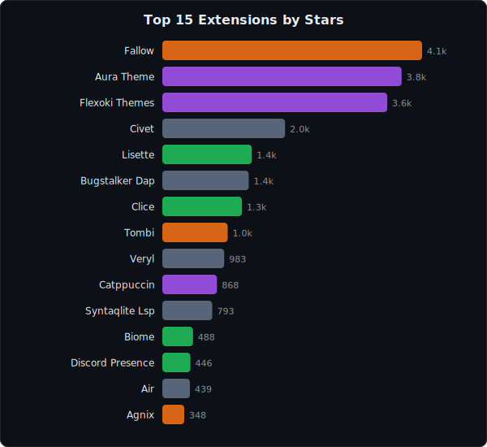
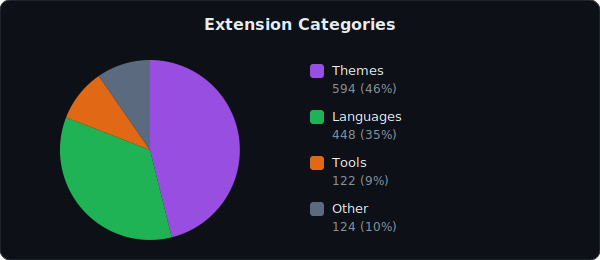

<h1>Awesome Zed Extensions</h1>

  <strong>Find the best extensions for <a href="https://zed.dev">Zed</a> — the high-performance code editor built in Rust.</strong> 
  <strong>1127 extensions tracked, ranked by GitHub stars, updated daily.</strong>

 

  &nbsp;
  &nbsp;
  

  Fully automated · Data sourced from the <a href="https://github.com/zed-industries/extensions">official Zed extension registry</a> · Last update: <strong>2026-04-24</strong>

---

> **Why this list?** Zed's built-in extension marketplace doesn't show star counts, trending extensions, or category breakdowns. This project fills that gap — helping you discover the most popular and actively maintained extensions at a glance.

## Contents

- [Overview](#overview)
- [Top Extensions](#-top-extensions)
- [Trending This Week](#-trending-this-week)
- [Recently Added](#-recently-added)
- [Themes](#-themes)
- [Languages](#-languages)
- [Tools](#-tools)
- [Other](#-other)
- [About](#about)

## Overview

  

  

---

## ⭐ Top Extensions

The most popular Zed extensions ranked by GitHub stars.

| # | Extension | Stars | Category | Status | Description |
|--:|-----------|------:|----------|--------|-------------|
| 1 | [Mistral Vibe](https://github.com/mistralai/mistral-vibe) | 4.0k | 📦 Other | Active | Minimal CLI coding agent by Mistral |
| 2 | [Aura Theme](https://github.com/daltonmenezes/aura-theme) | 3.8k | 🎨 Theme | Active | ✨ A beautiful dark theme for your favorite apps. |
| 3 | [Flexoki Themes](https://github.com/kepano/flexoki) | 3.3k | 🎨 Theme | Active | An inky color scheme for prose and code. |
| 4 | [Clice](https://github.com/clice-io/clice) | 1.2k | 🌐 Language | Active | A next-generation C++ language server for modern C++, focused on high performance and deep code intelligence |
| 5 | [Veryl](https://github.com/veryl-lang/veryl) | 919 | 📦 Other | Active | Veryl: A Modern Hardware Description Language |
| 6 | [Tombi](https://github.com/tombi-toml/tombi) | 872 | 🔧 Tool | Active | TOML Formatter / Linter / Language Server |
| 7 | [Lisette](https://github.com/ivov/lisette) | 867 | 🌐 Language | Active | A little language inspired by Rust that compiles to Go |
| 8 | [Catppuccin](https://github.com/catppuccin/zed) | 788 | 🎨 Theme | Active | 🦀 Soothing pastel theme for Zed |
| 9 | [Biome](https://github.com/biomejs/biome-zed) | 452 | 🌐 Language | Active | Biome extension for Zed |
| 10 | [Air](https://github.com/posit-dev/air) | 409 | 📦 Other | Active | R formatter and language server |
| 11 | [Discord Presence](https://github.com/xhyrom/zed-discord-presence) | 398 | 🌐 Language | Active | extension for zed that adds support for discord rich presence using lsp |
| 12 | [Catppuccin Blur](https://github.com/jenslys/zed-catppuccin-blur) | 304 | 🎨 Theme | Active | Catppuccin Theme but as blurred variants + custom ones |
| 13 | [Csskit Lsp](https://github.com/csskit/csskit) | 275 | 🔧 Tool | Active | Refreshing CSS |
| 14 | [Oxc](https://github.com/oxc-project/oxc-zed) | 224 | 🌐 Language | Active | Oxc extension for Zed |
| 15 | [Catppuccin Icons](https://github.com/catppuccin/zed-icons) | 220 | 🎨 Theme | Active | 🦊 Soothing pastel icons for Zed |
| 16 | [Agnix](https://github.com/avifenesh/agnix) | 207 | 🔧 Tool | Active | The missing linter and lsp for AI coding assistants. Validate CLAUDE.md, AGENTS.md, SKILL.md, hooks, MCP. Plugin for ... |
| 17 | [Postgres Context Server](https://github.com/zed-extensions/postgres-context-server) | 196 | 🔧 Tool | Active | An extension providing a Model Context Server extension for PostgreSQL |
| 18 | [tsgo](https://github.com/zed-extensions/tsgo) | 191 | 🔧 Tool | Active | Extension for Zed to support TypeScript Native |
| 19 | [Java](https://github.com/zed-extensions/java) | 177 | 🌐 Language | Active | Extension for Zed to support Java |
| 20 | [Vue](https://github.com/zed-extensions/vue) | 177 | 🌐 Language | Active | Vue support |
| 21 | [Css Modules Kit](https://github.com/mizdra/css-modules-kit) | 176 | 🌐 Language | Active | A toolkit for making CSS Modules useful. |
| 22 | [wakatime](https://github.com/wakatime/zed-wakatime) | 175 | 🌐 Language | Active | Zed plugin for automatic time tracking and metrics generated from your programming activity. |
| 23 | [Typst](https://github.com/WeetHet/typst.zed) | 150 | 🌐 Language | Active | Typst extension for zed |
| 24 | [GDScript](https://github.com/GDQuest/zed-gdscript) | 149 | 🌐 Language | Active | Zed support for the Godot game engine and the GDScript language |
| 25 | [macOS Classic Theme](https://github.com/huacnlee/zed-theme-macos-classic) | 147 | 🎨 Theme | Active | A macOS native style theme for Zed, let it same like native app in macOS. |
| 26 | [Zedokai](https://github.com/slymax/zedokai) | 140 | 🎨 Theme | Active | a theme for Zed based on the Monokai Pro color scheme |
| 27 | [Angular](https://github.com/nathansbradshaw/zed-angular) | 138 | 🌐 Language | Active | Angular Language support |
| 28 | [Comments Highlighter](https://github.com/thedadams/zed-comment) | 135 | 🌐 Language | Active | A comment extension for the Zed editor |
| 29 | [Swift](https://github.com/samuser107/zed-swift-extension) | 132 | 🌐 Language | Active | Extension for Zed to support Swift |
| 30 | [Ruby](https://github.com/zed-extensions/ruby) | 124 | 🌐 Language | Active | The Ruby language support for Zed editor |
| 31 | [C#](https://github.com/zed-extensions/csharp) | 123 | 🌐 Language | Active | C# support |
| 32 | [Jarl](https://github.com/etiennebacher/jarl) | 123 | 📦 Other | Active | Just another R linter |
| 33 | [LaTeX](https://github.com/rzukic/zed-latex) | 123 | 🌐 Language | Active | LaTeX language server and syntax highlighting for Zed. See wiki on GitHub for help. |
| 34 | [Nightfox Themes - opaque / blurred](https://github.com/cange/nightfox.zed) | 118 | 🎨 Theme | Active | A port of the Neovim theme to Zed editor |
| 35 | [Symposium](https://github.com/symposium-dev/symposium) | 112 | 📦 Other | Active | AI the Rust Way |
| 36 | [Git Firefly](https://github.com/d1y/git_firefly) | 110 | 🌐 Language | Active | Provides Git Syntax Highlighting |
| 37 | [Svelte](https://github.com/zed-extensions/svelte) | 109 | 🌐 Language | Active | Svelte support |
| 38 | [Julia](https://github.com/JuliaEditorSupport/zed-julia) | 108 | 🌐 Language | Active | Julia support for Zed. |
| 39 | [Compline](https://github.com/jblais493/compline) | 105 | 📦 Other | Active | A color palette for Deep contemplation and work |
| 40 | [Elle](https://github.com/acquitelol/elle) | 105 | 🌐 Language | Active | A procedural programming language built in Rust which compiles to QBE |
| 41 | [Context7 MCP Server](https://github.com/akbxr/zed-mcp-server-context7) | 103 | 🔧 Tool | Active | Context7 MCP Server for Zed |
| 42 | [Nix](https://github.com/hasit/zed-nix) | 103 | 🌐 Language | Active | Nix language support in Zed |
| 43 | [Scala](https://github.com/scalameta/metals-zed) | 101 | 🌐 Language | Active | Zed plugin for Metals |
| 44 | [Tokyo Night Themes](https://github.com/ssaunderss/zed-tokyo-night) | 100 | 🎨 Theme | Active | Tokyo Night Themes for the Zed IDE |
| 45 | [Pytest Language Server](https://github.com/bellini666/pytest-language-server) | 96 | 📦 Other | Active | 🔥 Pytest Language Server |
| 46 | [LiveServer](https://github.com/frederik-uni/zed-live-server) | 92 | 🔧 Tool | Active | Launch a development local Server with live reload feature |
| 47 | [Github Theme](https://github.com/PyaeSoneAungRgn/github-zed-theme) | 88 | 🎨 Theme | Active | GitHub's Zed themes  |
| 48 | [harper](https://github.com/zed-extensions/harper) | 85 | 🌐 Language | Active | Harper LS extension for the Zed editor |
| 49 | [GitHub MCP Server](https://github.com/LoamStudios/zed-mcp-server-github) | 85 | 🔧 Tool | Active | A GitHub MCP Server extension for Zed |
| 50 | [Material Icon Theme](https://github.com/zed-extensions/material-icon-theme) | 83 | 🎨 Theme | Active | Material Design icons for Zed |

<a href="#contents">↑ Back to top</a>

---

## 📈 Trending This Week

Extensions gaining the most stars over the past 7 days.

| Extension | Stars | Growth | Description |
|-----------|------:|-------:|-------------|
| [Opencode](https://github.com/sst/opencode) | 148.5k | 🔥 +3346 | The open source coding agent. |
| [Mistral Vibe](https://github.com/mistralai/mistral-vibe) | 4.0k | 🔥 +60 | Minimal CLI coding agent by Mistral |
| [Slint](https://github.com/slint-ui/slint) | 22.3k | 🔥 +57 | Slint is an open-source declarative GUI toolkit to build native user interfaces for Rust, C++, JavaScript, or Python ... |
| [Agnix](https://github.com/avifenesh/agnix) | 207 | +21 | The missing linter and lsp for AI coding assistants. Validate CLAUDE.md, AGENTS.md, SKILL.md, hooks, MCP. Plugin for ... |
| [Flexoki Themes](https://github.com/kepano/flexoki) | 3.3k | +16 | An inky color scheme for prose and code. |
| [Symposium](https://github.com/symposium-dev/symposium) | 112 | +16 | AI the Rust Way |
| [Lisette](https://github.com/ivov/lisette) | 867 | +15 | A little language inspired by Rust that compiles to Go |
| [Catppuccin](https://github.com/catppuccin/zed) | 788 | +12 | 🦀 Soothing pastel theme for Zed |
| [Tombi](https://github.com/tombi-toml/tombi) | 872 | +10 | TOML Formatter / Linter / Language Server |
| [ultraViolet](https://github.com/Gurvirr/zed-ultraViolet) | 80 | +8 | A dark, violet-toned theme designed for quality & visual comfort ◡̈ |
| [tsgo](https://github.com/zed-extensions/tsgo) | 191 | +7 | Extension for Zed to support TypeScript Native |
| [Discord Presence](https://github.com/xhyrom/zed-discord-presence) | 398 | +6 | extension for zed that adds support for discord rich presence using lsp |
| [Oxc](https://github.com/oxc-project/oxc-zed) | 224 | +6 | Oxc extension for Zed |
| [Aura Theme](https://github.com/daltonmenezes/aura-theme) | 3.8k | +4 | ✨ A beautiful dark theme for your favorite apps. |
| [Bloc](https://github.com/felangel/bloc) | 12.4k | +4 | A predictable state management library that helps implement the BLoC design pattern |
| [Dart](https://github.com/zed-extensions/dart) | 81 | +4 | Dart support |
| [Mermaid](https://github.com/gabeidx/zed-mermaid) | 63 | +4 | Mermaid support for Zed |
| [Biome](https://github.com/biomejs/biome-zed) | 452 | +3 | Biome extension for Zed |
| [Clice](https://github.com/clice-io/clice) | 1.2k | +3 | A next-generation C++ language server for modern C++, focused on high performance and deep code intelligence |
| [Comments Highlighter](https://github.com/thedadams/zed-comment) | 135 | +3 | A comment extension for the Zed editor |

<a href="#contents">↑ Back to top</a>

---

## 🆕 Recently Added

New extensions added to the Zed registry in the last 30 days.

| Extension | Stars | Category | Description |
|-----------|------:|----------|-------------|
| [Monokuro theme](https://github.com/KawaneNamito/zed-monokuro-theme) | 0 | 🎨 Theme | Monokuro is the romanization of the Japanese pronunciation of 'monochrome.' It's a simple black-and-white theme. |
| [Miramare](https://github.com/franbach/miramare-zed) | 0 | 🎨 Theme | 🍁 Comfortable & Pleasant Color Scheme for Zed |
| [Cyberpunk 2077](https://github.com/thomassimmer/cyberpunk-2077-zed-extension) | 1 | 📦 Other | A Zed theme extension inspired by Cyberpunk 2077 (Arasaka, Biotechnica, Softsys, NCPD, Kang Tao, Militech, Delamain, ... |
| [Umbra](https://github.com/zaitsev-av/umbra) | 0 | 🎨 Theme | Monochromatic dark theme with subtle semantic accents |
| [Import Cost](https://github.com/gcampes/zed-import-cost) | 1 | 🔧 Tool | Display inline the bundle size of imported JS/TS packages. Requires inlay hints enabled in settings. |
| [Noted Theme](https://github.com/sergeevalera/noted-theme) | 0 | 🎨 Theme | Zed theme using with Noted extension  |
| [Mainframe](https://github.com/jmg-duarte/mainframe-zed) | 0 | 📦 Other | Bringing back mainframe's one color at a time |
| [Oceans of Andromeda](https://github.com/jdonlucas/zed-oceans-of-andromeda) | 0 | 🎨 Theme | A beautiful dark theme inspired by the waters of Andromeda. Ported from VS Code. |
| [Remedy Theme](https://github.com/andrewRCr/zed-remedy-theme) | 0 | 🎨 Theme | A port of the Remedy color scheme for Zed. Includes dark and bright variants in opaque, blurred, and transparent styles. |
| [Grove](https://github.com/HimaAramona/grove-theme) | 0 | 🎨 Theme | A nature-inspired, Gruvbox-based color theme for Zed |
| [Sora](https://github.com/Aejkatappaja/sora-theme) | 0 | 🎨 Theme | Sora Theme for Zed - a deep colorscheme |
| [Px to Rem](https://github.com/ugi-dev/px-to-rem) | 0 | 🔧 Tool | Converts CSS px values to rem and vice versa directly in the editor. |
| [Serendipity Icons](https://github.com/meocoder31099/Serendipity-Icon-Theme-Zed) | 0 | 🎨 Theme | Serendipity icon theme for Zed |
| [HackTheBox](https://github.com/b00tk1ll/hackthebox-zed-theme) | 0 | 📦 Other | Extensão de temas para o Zed, com as famílias HackTheBox(cores alinhadas ao tema homónimo do VS Code) e HackTheBlu... |
| [ultraViolet](https://github.com/Gurvirr/zed-ultraViolet) | 80 | 🎨 Theme | A dark, violet-toned theme designed for quality & visual comfort ◡̈ |
| [Commander Gold Theme](https://github.com/koctep/z-commander-gold-theme) | 0 | 🎨 Theme | A Zed theme inspired by Norton Commander, Midnight Commander, and Borland editors: deep blue surfaces with gold text. |
| [Sunrise Bloom](https://github.com/tejasashinde/sunrise-bloom-theme) | 0 | 🎨 Theme | Cheerful sunrise-inspired theme for ZED with warm sunlight yellows, oranges, and balanced cool tones for a fresh morn... |
| [Rosewood](https://github.com/ayush-porwal/zed-rosewood-theme) | 0 | 🎨 Theme | A warm transparent theme. |
| [Lume Theme](https://github.com/danfry1/lume-zed-theme) | 0 | 🎨 Theme | Lume color theme for Zed |
| [Batsignal](https://github.com/kijv/batsignal-zed) | 0 | 📦 Other |  |
| [Lisette](https://github.com/ivov/lisette) | 867 | 🌐 Language | A little language inspired by Rust that compiles to Go |
| [Kubernetes Snippets](https://github.com/zed-kubernetes/kubernetes-snippets) | 1 | 📦 Other | Kubernetes YAML snippets with zero-config schema validation. |
| [Framer Dark Theme](https://github.com/gxanshu/zed-framer-dark) | 1 | 🎨 Theme | A dark, minimalist theme for the Zed editor, ported from Framer's code editor. |
| [WooCommerce Snippets](https://github.com/renzojohnson/woocommerce-snippets) | 0 | 📦 Other | WooCommerce snippets for Zed editor — 180 curated patterns with smart completions |
| [Relaxed](https://github.com/stefanbc/relaxed-zed-theme) | 0 | 🎨 Theme | A port of the Relaxed VS Code theme by Michael Kühnel. Dark theme with easy on the eyes colors. |
| [Pink Candy](https://github.com/paulovictor237/pink-candy-theme) | 1 | 🎨 Theme | Pink Candy dark theme for Zed — port of the VS Code Pink Candy theme by KubaP |
| [Ghostty Dark Inspired Theme](https://github.com/davideluzi/ghostty-dark-theme) | 1 | 🎨 Theme | Theme inspired on Ghostty terminal emulator dark theme for Zed |
| [Pointer Theme](https://github.com/nezdemkovski/pointer-theme-for-zed) | 0 | 🎨 Theme | A theme inspired by the Cursor IDE aesthetic, bringing its familiar dark and light styling to Zed |
| [MLIR](https://github.com/feichai0017/mlir-zed) | 1 | 🌐 Language | MLIR and TableGen syntax highlighting for Zed. |
| [Borderless Minimal](https://github.com/hatemecha/borderless-minimal-zed) | 0 | 🎨 Theme | Borderless dark themes for Zed. Green, amber, and ice variants. |

<a href="#contents">↑ Back to top</a>

---

## 🎨 Themes

Color themes and icon packs for Zed.

| # | Extension | Stars | Description |
|--:|-----------|------:|-------------|
| 1 | [Aura Theme](https://github.com/daltonmenezes/aura-theme) | 3.8k | ✨ A beautiful dark theme for your favorite apps. |
| 2 | [Flexoki Themes](https://github.com/kepano/flexoki) | 3.3k | An inky color scheme for prose and code. |
| 3 | [Catppuccin](https://github.com/catppuccin/zed) | 788 | 🦀 Soothing pastel theme for Zed |
| 4 | [Catppuccin Blur](https://github.com/jenslys/zed-catppuccin-blur) | 304 | Catppuccin Theme but as blurred variants + custom ones |
| 5 | [Catppuccin Icons](https://github.com/catppuccin/zed-icons) | 220 | 🦊 Soothing pastel icons for Zed |
| 6 | [macOS Classic Theme](https://github.com/huacnlee/zed-theme-macos-classic) | 147 | A macOS native style theme for Zed, let it same like native app in macOS. |
| 7 | [Zedokai](https://github.com/slymax/zedokai) | 140 | a theme for Zed based on the Monokai Pro color scheme |
| 8 | [Nightfox Themes - opaque / blurred](https://github.com/cange/nightfox.zed) | 118 | A port of the Neovim theme to Zed editor |
| 9 | [Tokyo Night Themes](https://github.com/ssaunderss/zed-tokyo-night) | 100 | Tokyo Night Themes for the Zed IDE |
| 10 | [Github Theme](https://github.com/PyaeSoneAungRgn/github-zed-theme) | 88 | GitHub's Zed themes  |
| 11 | [Material Icon Theme](https://github.com/zed-extensions/material-icon-theme) | 83 | Material Design icons for Zed |
| 12 | [The Dark Side](https://github.com/Imgkl/the-dark-side) | 81 | True Dark Theme for Zed IDE |
| 13 | [ultraViolet](https://github.com/Gurvirr/zed-ultraViolet) | 80 | A dark, violet-toned theme designed for quality & visual comfort ◡̈ |
| 14 | [Fleet Themes](https://github.com/skarline/zed-fleet-themes) | 78 | 🚢 Transform Zed with Fleet's sleek, modern aesthetic for a sublime coding experience. |
| 15 | [XY-Zed Theme](https://github.com/zarifpour/xy-zed) | 78 | 🐈‍⬛ A sleek and sophisticated dark theme for Zed with vibrant, intelligent syntax highlighting. |
| 16 | [Kanagawa Themes](https://github.com/ethangilmore/zed-kanagawa) | 71 | 🌊 Zed port of rebelot's Kanagawa.nvim theme |
| 17 | [Kanso Theme](https://github.com/webhooked/kanso-zed) | 71 | A dark theme that invites focus, not attention. An elegant evolution of the original Kanagawa theme. |
| 18 | [Xcode Themes](https://github.com/skarline/zed-xcode-themes) | 68 | 🍎 Recreate Xcode's native feel in Zed with authentic themes for a seamless, Apple-inspired coding environment. |
| 19 | [Dracula](https://github.com/dracula/zed) | 65 | 🧛🏻‍♂️ Dark theme for Zed |
| 20 | [Quill Theme](https://github.com/CraftQuill/zed-theme-quill) | 59 | 🪶 Quill theme for Zed |
| 21 | [Rosé Pine](https://github.com/rose-pine/zed) | 55 | Soho vibes for Zed |
| 22 | [Min Theme](https://github.com/phibr0/zed-min-theme/) | 54 | minimal theme for the zed editor |
| 23 | [Modus Themes](https://github.com/vitallium/zed-modus-themes) | 46 | Port of Modus Themes (https://protesilaos.com/emacs/modus-themes) for Zed |
| 24 | [Color Highlight](https://github.com/huacnlee/color-lsp) | 44 | A document color language server. |
| 25 | [JetBrains New UI Theme](https://github.com/kpitt/zed-theme-intellij-newui) | 44 | Zed editor theme based on the colors of the JetBrains IntelliJ "New UI". |
| 26 | [Vercel Theme](https://github.com/NathanBrodin/zed-vercel-theme) | 44 | The Vercel Theme, for Zed |
| 27 | [Charmed Icons](https://github.com/jmesrje/zed-charmed-icons) | 41 | A charming icon theme for Zed |
| 28 | [Everforest Theme](https://github.com/ThomasAlban/everforest-zed) | 40 | 🌲 Comfortable & Pleasant Color Scheme for Zed |
| 29 | [VSCode Dark Modern](https://github.com/kcamcam/vscode_dark_modern.zed) | 40 | VS Code Dark Modern theme for Zed |
| 30 | [Alabaster](https://github.com/tsimoshka/zed-theme-alabaster) | 39 | Alabaster color scheme (port of https://github.com/tonsky/sublime-scheme-alabaster) |
| 31 | [Monosami Theme](https://github.com/borngraced/monosami) | 39 | 98% black and white monochrome theme for Zed Editor |
| 32 | [base16](https://github.com/bswinnerton/base16-zed) | 37 | The base16 themes for the Zed editor |
| 33 | [0x96f Theme](https://github.com/0x96f-org/0x96f-zed-theme) | 36 | A simple and pleasant dark theme for Zed |
| 34 | [Nord Themes](https://github.com/mikasius/zed-nord-theme) | 35 | Nord theme for zed |
| 35 | [Pierre Theme](https://github.com/pierrecomputer/theme) | 33 | Custom theme for VS Code and Shiki projects, built with Pierre's color scheme. |
| 36 | [Colorizer](https://github.com/tamimhasandev/colorizer) | 30 | Colorizer is a zed code editor theme that will help you write better code with a better look |
| 37 | [New Darcula Theme](https://github.com/e-simpson/new-darcula-z) | 30 | Modern take on the Darcula theme, now for Zed. |
| 38 | [Call trans opt: received. 2-19-98 13:24:18 REC:Log> Theme](https://github.com/takk8is/call-trans-opt-received-2-19-98-13-24-18-rec-log-theme-for-zed) | 28 | A iconic aesthetic of the shell screen from the 1999 film The Matrix, Inspired by the film's opening command Call tra... |
| 39 | [Vesper](https://github.com/bdsqqq/vesper-zed) | 28 | Peppermint and orange flavored dark theme for Zed. |
| 40 | [Colored Zed Icons Theme](https://github.com/TheRedXD/zed-icons-colored-theme) | 27 | The default Zed icons, except they're colored! |
| 41 | [Nstlgy Dark Theme](https://github.com/nstlgy/zed-nstlgy-dark) | 26 | Elegant dark theme for Zed Code Editor  |
| 42 | [Gruvbox Material](https://github.com/tokiory/zed-gruvbox-material) | 25 | 🎨 💫 Gruvbox Material Theme for the Zed Editor |
| 43 | [JetBrains Themes](https://github.com/artemevsevev/zed-theme-jetbrains) | 25 | JetBrains Themes for Zed Editor |
| 44 | [Material Theme](https://github.com/Codextor/zed-material-theme) | 25 | Material Theme for Zed |
| 45 | [JetBrains New UI Icon Theme](https://github.com/ankddev/zed-jetbrains-newui-icons) | 22 | JetBrains New UI Icons Theme for Zed editor. |
| 46 | [Oxocarbon (IBM Carbon) Theme](https://github.com/Takk8IS/oxocarbon-theme-for-zed) | 22 | The "Oxocarbon Theme for Zed" brings the sleek, modern aesthetics inspired by IBM Carbon Design System to your Zed ed... |
| 47 | [Evil Rabbit Theme](https://github.com/kettanaito/zed-theme-evil-rabbit) | 21 | An Evil Rabbit theme for Zed. |
| 48 | [GitHub Dark Default](https://github.com/MordFustang21/zed-github-dark) | 20 | A GitHub dark theme for Zed |
| 49 | [Halcyon Theme](https://github.com/hichemfantar/halcyon-zed) | 20 | A dark blue theme for Zed |
| 50 | [Modest Dark](https://github.com/timcole/modest-dark) | 20 | A modest zed theme based on one dark but with brighter colours on a darker background |
| 51 | [Serendipity Themes](https://github.com/meocoder31099/Serendipity-Theme-Zed) | 20 | Relaxed, gentle and modern - Serendipity theme for Zed |
| 52 | [Symbols](https://github.com/sebastiandotdev/zed-symbols) | 19 | A simple file icon theme for Zed. |
| 53 | [Syntax](https://github.com/syntaxfm/syntax-zed-theme) | 19 | A Syntax theme for Zed. |
| 54 | [Matte Black](https://github.com/tahayvr/matte-black-zed) | 18 | A low distraction dark theme for Zed Editor |
| 55 | [Adwaita Pastel Theme](https://github.com/Benjamin-Davies/zed-theme-adwaita) | 17 | Adwaita (GNOME) theme for Zed with bold syntax highlighting borrowed from Catppuccin |
| 56 | [Melange Theme](https://github.com/adorabilis/melange-zed) | 17 | Melange theme for Zed with dark and light variants |
| 57 | [shhhed](https://github.com/mkhamat/shhhed) | 17 | 🤫 Theme that dims the scaffolding and colors what matters. |
| 58 | [Bearded Icon Theme](https://github.com/sethstha/bearded-icons-theme) | 16 | Beautiful Icon theme for Zed Code Editor. Port of Bearded Icon Theme for VSCode |
| 59 | [One Black Theme](https://github.com/serhiiboreiko/one-black-theme-zed) | 16 | One Dark got even dar..kier  |
| 60 | [Zed Legacy Themes](https://github.com/zed-extensions/legacy-themes) | 16 | Zed Legacy Themes |
| 61 | [Cobalt2](https://github.com/wesbos/cobalt2-zed) | 15 | Cobalt2 Theme for Zed |
| 62 | [One Dark Pro Monokai Darker Theme](https://github.com/9ssi7/zed-one-dark-pro-monokai-darker) | 15 | A Darker One Dark Pro variation with Monokai scheme for Zed |
| 63 | [Nightfox Themes](https://github.com/ssaunderss/zed-nightfox) | 14 | Nightfox Themes for the Zed IDE |
| 64 | [Ultimate Dark Neo](https://github.com/rubjo/ultimate-dark-neo-zed) | 14 | Port of Ultimate Dark Neo to Zed editor |
| 65 | [Panda Theme](https://github.com/biaqat/panda-theme-zed) | 13 | Panda Syntax theme for Zed |
| 66 | [Short Giraffe Theme](https://github.com/Mehdi-Hp/Short-Giraffe) | 13 | A dark theme with carefully picked colors |
| 67 | [Ayu Darker Theme](https://github.com/k4yt3x/zed-theme-ayu-darker) | 12 | A darker variant of the Ayu Dark theme for Zed. |
| 68 | [Cosmos](https://github.com/nauvalazhar/cosmos) | 12 | Dark theme based on Tokyo Night for Zed |
| 69 | [Flat Theme](https://github.com/biaqat/flat-theme-zed) | 12 | Minimal, easy on the eyes theme inspired by flatwhite syntax from Atom |
| 70 | [Graphene Theme](https://github.com/adinack/graphene) | 12 | A practical dark theme for Zed. |
| 71 | [Green Monochrome Monitor CRT Phosphor Theme](https://github.com/Takk8IS/green-monochrome-monitor-crt-phosphor-theme-for-zed) | 12 | Designed to replicate the classic CRT monitors, black background with vibrant green text in the dark, while the light... |
| 72 | [JetBrains Icons](https://github.com/ziishaned/zed-jetbrains-icons) | 12 | JetBrains Icons for Zed |
| 73 | [Snazzy](https://github.com/Eivs/zed-snazzy) | 12 | A port of the popular Snazzy color scheme for the Zed editor. |
| 74 | [Srcery theme](https://github.com/srcery-colors/srcery-zed) | 12 | Srcery color scheme for the Zed code editor |
| 75 | [TSAR Theme](https://github.com/x032205/tsar-zed-theme) | 12 | Minimal and modern semi-transparent dark theme. |
| 76 | [Vitesse Theme Refined](https://github.com/colinlienard/zed-vitesse-theme-refined) | 12 | 🏕 Refined Vitesse theme for Zed |
| 77 | [VSCode Light+](https://github.com/MadLittleMods/zed-theme-vscode-light-plus) | 12 | Port of the VSCode Light+ (Default Light+) theme for the Zed code editor |
| 78 | [Catbox theme](https://github.com/adibhanna/catbox) | 11 | Gruvbox-based Zed theme |
| 79 | [Night Owl Theme](https://github.com/elGusto/night-owlz) | 11 | Night Owl theme for Zed |
| 80 | [Sublime Mariana Theme](https://github.com/hnatiukr/zed-mariana-theme) | 11 | Mariana theme for Zed editor |
| 81 | [Zedwaita](https://github.com/someone13574/zed-adwaita-theme) | 11 | Light and dark Adwaita theme for Zed |
| 82 | [Zen Abyssal](https://github.com/KevInCompile/ZenAbyssal) | 11 | A theme you'll probably like for zed. |
| 83 | [Adwaita](https://github.com/somepaulo/adwaita-zed-theme) | 10 | A GNOME Adwaita styled theme for Zed with syntax highlighting based on the gtksourceview Adwaita style. Includes both... |
| 84 | [Crimson Theme](https://github.com/kaem-e/zed-crimson-theme) | 10 | A theme for zed based off of the recent t3.chat redesign |
| 85 | [Everforest Theme (regular, material, blur)](https://github.com/albertsko/zed-everforest) | 10 | 🌲 Everforest for Zed |
| 86 | [Hami Melon Theme](https://github.com/isunjn/hami-melon-zed) | 10 | 🍈 Organic green and orange flavored code editor theme |
| 87 | [One Dark Pro Max](https://github.com/kussumma/one-dark-pro-max) | 10 | Zed Theme: One Dark Pro Max :) |
| 88 | [Oscura Theme](https://github.com/webhooked/oscura-zed) | 10 | An unapologetically dark and minimal colorscheme for Zed. |
| 89 | [Tomorrow Theme](https://github.com/biaqat/tomorrow-theme-zed) | 10 | Theme Based on chriskempson's Tomorrow Theme, VS Code's Tomorrow Night Blue, and mdBook's Coal Theme |
| 90 | [Tron Legacy](https://github.com/bcomnes/zed-theme-tron-legacy) | 10 | A port of the Tron Legacy theme to Zed |
| 91 | [Amber Monochrome Monitor CRT Phosphor Theme](https://github.com/Takk8IS/amber-monochrome-monitor-crt-phosphor-theme-for-zed) | 9 | Designed to replicate the classic CRT monitors, this theme features a black background with vibrant amber text for th... |
| 92 | [Chocolate Theme](https://github.com/brunozalc/zed-chocolate) | 9 | Chocolate theme for Zed 🍫 |
| 93 | [Dune Theme](https://github.com/Anvell/zed-dune-theme) | 9 | Harmonic theme for Zed |
| 94 | [Gruber Flavors](https://github.com/biaqat/gruber-theme-zed) | 9 | 15 flavors of a theme for recreational programmers. |
| 95 | [Kiselevka dark theme](https://github.com/kdubrovsky/kiselevka) | 9 | Kiselevka dark color theme for the Zed code editor |
| 96 | [Mellow](https://github.com/sonodima/zed-mellow) | 9 | Zed port of the Mellow color scheme |
| 97 | [Monokai Night Theme](https://github.com/farbodvand/zed-monokai-night) | 9 | 🌃 A dark theme with two accents and vibrant syntax highlighting for Zed. |
| 98 | [Neovim default themes](https://github.com/KimNorgaard/zed-neovim-default) | 9 | Neovim default themes for the Zed editor |
| 99 | [poimandres](https://github.com/mshaugh/poimandres.zed) | 9 | ⚫️ poimandres zed theme |
| 100 | [Popping and Locking Theme](https://github.com/randoneering/popping-and-locking-zed-theme) | 9 | This is my attempt at porting the 'popping and locking' theme used in iTerm2, ghostty, atom, vscode, and other tools. |
| 101 | [Shades of Purple Theme](https://github.com/irmhonde/shades-of-purple-theme) | 9 | Shades of purple theme for Zed. |
| 102 | [🌌 Dark Pop UI 🎨](https://github.com/kunal-arora/zed-theme-dark-pop-ui) | 8 | Theme extension for Zed Editor |
| 103 | [Maple Theme](https://github.com/subframe7536/zed-theme-maple) | 8 | A colorful Zed theme, support light or dark mode, with medium brightness and low saturation. |
| 104 | [Mnemonic](https://github.com/mnemonic-theme/zed) | 8 | :gem: Vibrant and purposeful theme family for the Zed editor |
| 105 | [Napalm Theme](https://github.com/napalmpapalam/napalm-theme-zed) | 8 | A minimalistic dark theme, mix of GitHub Dark UI theme and VSCode Dark+ theme syntax highlighting. |
| 106 | [Old Book](https://github.com/gko/oldbook-theme) | 8 | Colorscheme inspired by the feel of aged books. Minimal, soft, and readable. |
| 107 | [Smooth Theme](https://github.com/segersniels/zed-smooth) | 8 | Aesthetically pleasing dark and light theme with soft pastel colors aiming to be very easy on the eyes. |
| 108 | [Beanseeds Pro Theme](https://github.com/tokiory/beanseeds-pro) | 7 | 👀 Beanseeds Pro is a refined adaptation of the classic Jellybeans theme |
| 109 | [Cyan Light Theme](https://github.com/biaqat/cyan-light-theme-zed) | 7 | Port of the Cyan Light Theme from the JetBrains Marketplace |
| 110 | [Discord Theme](https://github.com/zangetsu02/zed-discord-theme) | 7 | A theme for Zed inspired by Discord's new dark theme. |
| 111 | [Exquisite Theme](https://github.com/xqsit94/zed-xqsit-theme) | 7 | xQsit theme for zed |
| 112 | [Godot Theme](https://github.com/D4r3NPo/zed-godot-theme) | 7 | Godot theme for Zed |
| 113 | [Horizon](https://github.com/ayn2op/zed-horizon) | 7 | Horizon theme for Zed |
| 114 | [KTRZ Monokai Theme](https://github.com/pcminh0505/ktrz-monokai-zed-theme) | 7 | KTRZ Monokai Theme for Zed IDE |
| 115 | [nyxvamp](https://github.com/nyxvamp-theme/zed) | 7 | theme inspired by transfem emo aesthetics - special for cat girls 💜😺 |
| 116 | [One Dark - Darkened](https://github.com/pavles6/one-dark-darkened) | 7 | A darkened variant with enhanced contrast of One Dark theme for Zed. |
| 117 | [Taiga Theme](https://github.com/joshdales/taiga-theme) | 7 | A theme for VSCode and friends - with light and dark modes |
| 118 | [Vague Theme](https://github.com/vague-theme/vague-zed) | 7 | A cool, dark, low contrast colorscheme for Zed. Pastel yet vivid, like a fleeting memory...  |
| 119 | [VSCode Dark High Contrast](https://github.com/nick-myrick/vscode-dark-high-contrast) | 7 | VSCode Dark High Contrast Theme for Zed |
| 120 | [VSCode Great Icons Theme](https://github.com/RandaZraik/zed-vscode-great-icons) | 7 | VSCode great icons theme for Zed Editor |
| 121 | [Warm Burnout Theme](https://github.com/felipefdl/warm-burnout) | 7 | The theme suite for developers who already burned out but still have deadlines. Warm palette, minimal blue light, WCA... |
| 122 | [Aesthetic Theme](https://github.com/mnojz/Aesthetic-zed-theme) | 6 | A soft, eye-comforting bluish dark theme for Zed. made with love 💝 |
| 123 | [Chanterelle Theme](https://github.com/steffenhaug/chanterelle-zed) | 6 | A dark theme inspired by the nordic forest |
| 124 | [Claude Code Inspired Dark](https://github.com/ericbuess/claude-code-inspired-dark) | 6 | A dark theme for Zed inspired by Claude and Anthropic's brand colors with semi-transparent backgrounds. |
| 125 | [Eclat](https://github.com/utakotoba/eclat-zed) | 6 | Immersed in peace and a muted Zed editor theme. |
| 126 | [Indigo Theme](https://github.com/p3rception/Indigo-zed) | 6 | // Theme for the Zed Editor - 20k downloads |
| 127 | [Mariana Theme](https://github.com/biaqat/mariana-theme-zed) | 6 | Sublime 4's Mariana Theme for Zed |
| 128 | [Monokai Original](https://github.com/sidwachche/monokai-og-zed) | 6 | A faithful recreation of the original Monokai theme for Zed editor |
| 129 | [Monospace Icon Theme](https://github.com/irmhonde/monospace-icon-theme) | 6 | Monospace icon theme for Zed. |
| 130 | [orng](https://github.com/elithrar/orng-zed) | 6 | A Cloudflare-themed, well, theme... for the Zed editor. |
| 131 | [Rich Vesper](https://github.com/zezic/rich-vesper-zed) | 6 | Modified peppermint and orange flavored dark theme for Zed. |
| 132 | [Snowfall Theme](https://github.com/freethinkel/snowfall-zed) | 6 | ❄️ Winter theme for Zed |
| 133 | [Sumi Light Theme](https://github.com/LogicSatinn/sumi-light-zed) | 6 | Inspired by the subtle beauty of Japanese sumi-e ink painting, Sumi Light brings a serene monochromatic palette to yo... |
| 134 | [Synthwave Alpha Theme](https://github.com/vikpe/synthwave-alpha-zed) | 6 | Synthwave inspired dark mode theme for Zed. |
| 135 | [v0 theme](https://github.com/biaqat/v0-theme-zed) | 6 | Theme used in v0 chat ported for zed |
| 136 | [VSCode Dark Polished](https://github.com/yayashn/vscode-dark-polished) | 6 | Polished and comprehensive VSCode Dark Modern theme for Zed. |
| 137 | [VSCode Modern Theme](https://github.com/fabrialberio/zed-vscode-modern-theme) | 6 | VSCode Modern theme for Zed |
| 138 | [Zoegi Theme](https://github.com/nikitapashinsky/zoegi-theme) | 6 | A port of Moegi theme for Zed |
| 139 | [1984 Theme](https://github.com/chenmijiang/zed-1984) | 5 | CYBERPUNK MODE IS MADE FOR LONG-TERM USAGE |
| 140 | [Aquaflow Theme](https://github.com/Whitfrost21/zed-Aquaflow) | 5 | My personal zed theme , greenish aqua theme for zed code editor |
| 141 | [Blankeos Zen](https://github.com/Blankeos/zen.zed) | 5 | 🦋 A bluer poimandres Zed theme. Forked from poimandres. |
| 142 | [Bluloco Theme](https://github.com/uloco/bluloco-zed) | 5 | bluloco theme for zed editor |
| 143 | [Catppuccin Theme (Blue Blur+)](https://github.com/taciturnaxolotl/catppuccin-blur-zed) | 5 | Catpuccin for Zed but if it was blurred and had blue accents by default |
| 144 | [Chai Theme](https://github.com/rushabhcodes/zed-chai-theme) | 5 | Chai Theme for Zed |
| 145 | [Cyberpunk Scarlet](https://github.com/samurmaykrr/cyberpunk-scarlet-zed) | 5 | cyberpunk scarlet red protocol theme for zed |
| 146 | [Darcula Dark Theme](https://github.com/not-a-cowfr/Darcula-Dark) | 5 | Darcula Dark theme for zed |
| 147 | [Darkmatter Theme](https://github.com/stevedylandev/darkmatter-theme-zed) | 5 | Darkmatter theme based on Base16 Black Metal Bathory |
| 148 | [Emerald Night](https://github.com/iamngoni/emerald-night-theme) | 5 | Emerald Night Zed Theme |
| 149 | [Gentle Dark Theme](https://github.com/gentlelionstudios/gentle-dark-zed) | 5 | Dark theme for the Zed code editor |
| 150 | [Gleam Theme](https://github.com/DanielleMaywood/gleam-theme-zed) | 5 | Theme inspired by gleam.run |
| 151 | [Gruber Darker](https://github.com/th0jensen/gruber-darker.zed) | 5 | A port of Rexim's amazing Gruber Darker theme from emacs to Zed. Available for download in the Zed code editor. |
| 152 | [Jellybeans Theme](https://github.com/rajerthat1/jellybeans.zed) | 5 | Zed port of nanotech's jellybeans.vim theme |
| 153 | [Material Dark Theme](https://github.com/xerodark/zed-material-theme) | 5 | Imitation of Google's Material theme for the Zed IDE. |
| 154 | [Neon Comfy & Soft Themes (opaque/blured/transparent)](https://github.com/guustavocl/zed-neon-comfy-soft-themes) | 5 | A Comfy & Soft Dark theme with neon Violet, Pink and Vaporwave syntax colors. |
| 155 | [Nordic.nvim Theme](https://github.com/kislikjeka/zed-theme-nordic) | 5 | Zed theme inspired by nordic.nvim |
| 156 | [Quiet Light Theme](https://github.com/biaqat/quiet-light-theme-zed) | 5 | VSCode's Quiet Light theme for Zed |
| 157 | [Sercali](https://github.com/Bilal-AKAG/Zed-sercali-theme) | 5 | A Gilded Void theme family for Zed: deep neutral basalts with Gold, Teal, and Malachite accents. |
| 158 | [Siri Theme](https://github.com/perragnar/zed-theme-siri) | 5 | Siri, a Zed dark and light theme |
| 159 | [Tailwind Syntax](https://github.com/biaqat/tailwind-theme-zed) | 5 | Tailwind theme for Zed |
| 160 | [Tomorrow Night Burns](https://github.com/alii/zed-tomorrow-night-burns) | 5 | Tomorrow Night Burns theme for Zed (iTerm2 & Ghostty) |
| 161 | [Yue Theme](https://github.com/biaqat/yue-theme-zed) | 5 | Theme based off the moonscript.org code examples |
| 162 | [Andromeda](https://github.com/ChocolateNao/andromeda-zed) | 4 | 🌒 A popular VScode theme brought to Zed |
| 163 | [Anthracite](https://github.com/boycsuk/anthracite-theme) | 4 | Anthracite theme for Zed Editor. |
| 164 | [Atomize](https://github.com/zhouyuxiang0/atomize.zed) | 4 | A detailed and accurate Atom One Dark theme |
| 165 | [Barbenheimer Theme](https://github.com/jayvicsanantonio/barbenheimer-zed-theme) | 4 | This Zed theme is inspired by the "Barbenheimer" cultural phenomenon, offering distinct styles that capture the essen... |
| 166 | [Blank Theme](https://github.com/kiritocode1/Blank-Theme) | 4 | One theme, thoughtfully crafted to feel at home across VS Code, Cursor, Zed, and Neovim. |
| 167 | [ChatGPT Theme](https://github.com/Takk8IS/chatgpt-theme-for-zed) | 4 | 📺 Inspired by the sleek design and intuitive color scheme of ChatGPT, this theme offers a refreshing and visually ... |
| 168 | [City Lights](https://github.com/DP19/zed-theme-city-lights) | 4 | City Lights Theme for Zed |
| 169 | [Transparent Prism Collection](https://github.com/MagnusPladsen/dark-glass-theme) | 4 | A translucent dark theme for Zed editor based on Zedokai Darker (Filter Spectrum) |
| 170 | [Dogi](https://github.com/DogukanUrker/DogiZed) | 4 | A minimalist flat theme with pure black and white backgrounds, vibrant syntax colors, and consistent medium font weig... |
| 171 | [Ghost in the Shell Theme](https://github.com/ddoemonn/ghost-in-the-shell-theme) | 4 | A cyberpunk-inspired theme for Zed editor based on Ghost in the Shell. |
| 172 | [Hacker Night Vision Theme](https://github.com/Takk8IS/hacker-night-vision-theme-for-zed) | 4 | 📺 A monochromatic theme with a vibrant palette for effective contrast. Inspired by secret agency operating systems... |
| 173 | [Iceberg Theme](https://github.com/EFDos/iceberg-zed-theme) | 4 | Zed theme based on the Iceberg Theme |
| 174 | [Little League Theme](https://github.com/ilikescience/little-league) | 4 | Little League: a VS Code theme with quiet, harmonious colors. |
| 175 | [Mau Theme](https://github.com/mauscoelho/zed-mau-themes) | 4 | Mau Zed theme |
| 176 | [Monospace Theme](https://github.com/Abhinav5383/zed-monospace-theme) | 4 | IDX Monospace theme for zed |
| 177 | [msun-dark](https://github.com/mikesun/msun-dark-zed) | 4 | Minimalist dark themes |
| 178 | [NeoSolarized Theme](https://github.com/carlocaione/NeoSolarized.zed) | 4 | NeoSolarized Zed theme. |
| 179 | [Noctis](https://github.com/sidwachche/noctis-port) | 4 | A Noctis theme for Zed |
| 180 | [Oceanic Next Theme](https://github.com/rkunev/oceanic-next) | 4 | A port of the popular Oceanic Next theme for the Zed editor. |
| 181 | [Outrun](https://github.com/Acepie/OutrunZedTheme) | 4 | A theme I made for [Zed](https://zed.dev/) |
| 182 | [PaperColor](https://github.com/emirror-de/papercolor-zed) | 4 | The original PaperColor Theme, inspired by Google Material Design, ported to Zed. |
| 183 | [Synthwave84](https://github.com/hydepwns/synthwave84-zed) | 4 | Synthwave84 for Zed editor |
| 184 | [Tiniri](https://github.com/vladstudio/tiniri-zed) | 4 | Calm and cozy color themes with warm, desaturated colors in light and dark variants |
| 185 | [Vesper Blur](https://github.com/taras-tereschenko/vesper-blur) | 4 | Vesper dark theme with blur/transparency effects for Zed |
| 186 | [VSCode classic theme](https://github.com/CharlesSBL/-vscode_classic_theme.zed) | 4 | VSCode Classic Theme |
| 187 | [Wakfu Theme](https://github.com/JulesSorensen/zed-wakfu-theme) | 4 | Wakfu theme for Zed IDE |
| 188 | [Zedburn](https://github.com/rmoraes92/zedburn) | 4 | Zenburn for Zed Editor |
| 189 | [Zen](https://github.com/kennyheard/zed-theme-zen) | 4 | A Zed theme designed for clarity and focus. |
| 190 | [Aira Theme](https://github.com/talison-cardoso/aira-zed) | 3 | A calm green theme for Zed, crafted to enhance focus and visual comfort. |
| 191 | [Alabaster Dark](https://github.com/findrakecil/alabaster-dark-zed-theme) | 3 | Alabaster Dark theme for Zed (ported from https://github.com/tonsky/sublime-scheme-alabaster) |
| 192 | [Aquarium Theme](https://github.com/biaqat/aquarium-theme-zed) | 3 | A colorful, dark, cozy Zed port of the Aquarium theme. |
| 193 | [Ariake](https://github.com/artivilla/zed-ariake-theme) | 3 | Zed IDE Ariake themes inspired by Japanese traditional colors and ancient poetry |
| 194 | [Atom One Theme](https://github.com/Stelath/zed-atom-one-theme) | 3 | A port of the old Atom text editor's theme to Zed |
| 195 | [Aylin Theme](https://github.com/biaqat/aylin-theme-zed) | 3 | A port of a port of Aylin: a modern and minimal dark theme with bright colors for Zed |
| 196 | [Bamboo](https://github.com/LoamStudios/zed-bamboo-theme) | 3 | A port of the Bamboo theme to Zed |
| 197 | [CodeSandbox Theme](https://github.com/MartinRybergLaude/zed-theme-codesandbox) | 3 | An unofficial CodeSandbox theme for Zed |
| 198 | [Cursor Theme](https://github.com/takk8is/cursor-theme-for-zed) | 3 | 📺 A theme that recreates the Cursor IDE experience within Zed, bringing familiar styling and interface elements fr... |
| 199 | [Dev Magic](https://github.com/susanta96/dev-magic) | 3 | A magical dark theme for Zed Code Editor |
| 200 | [Eiffel Theme](https://github.com/demiurg/zed-theme-eiffel) | 3 | A port of the Eiffel Textmate theme. |
| 201 | [Ember Theme](https://github.com/biaqat/ember-theme-zed) | 3 | Ember Colorscheme port for Zed |
| 202 | [Focus Theme](https://github.com/jigyansunanda/focus) | 3 | Focus is a collection of themes for Zed code editor to help you focus only on code. |
| 203 | [gafelson Theme](https://github.com/GafelSon/zed-theme) | 3 | A sleek, focused dark theme for Zed |
| 204 | [Github Classic](https://github.com/meocoder31099/Github-Classic-Theme-Zed) | 3 | The classic GitHub Light and GitHub Dark themes for Zed |
| 205 | [GitHub Copilot Theme](https://github.com/ssaunderss/zed-gh-copilot-theme) | 3 | GitHub Copilot Theme for Zed  |
| 206 | [Jetbrains Darcula theme by bronya0](https://github.com/Bronya0/Jetbrains-Darcula-Zed-Theme) | 3 | Jetbrains-Darcula-Zed-Theme |
| 207 | [JetBrains Rider](https://github.com/NarmadaWeb/jetbrains-rider-zed) | 3 | Jetbrains Rider Dark Theme |
| 208 | [Martianized](https://github.com/clamjohnston/martianized) | 3 | A dark color scheme with a focus on reds, browns, and icy whites. |
| 209 | [Modern Icons Theme](https://github.com/BadRat-in/zed-modern-icons) | 3 | 🎨 A modern, theme-aware icon set for the Zed editor — supports light and dark modes with clean, developer-friend... |
| 210 | [Monolith](https://github.com/someone13574/zed-monolith-theme) | 3 | A clean dark theme |
| 211 | [Moonlight](https://github.com/Rick-VA/moonlight) | 3 | Moonlight theme for Zed ide |
| 212 | [Noir & Blanc](https://github.com/chaseweaver/noir-and-blanc) | 3 | Minimal black and white themes for Zed |
| 213 | [Nordic Theme](https://github.com/biaqat/nordic-theme-zed) | 3 | Nordic theme for Zed |
| 214 | [Oasis Theme](https://github.com/aerendem/oasis-zed-theme) | 3 | A minimal, soothing theme for your high-frequency coding experience |
| 215 | [One Dark Extended Theme](https://github.com/uonick/zed-one-dark-extended) | 3 | One Dark Extended Zed theme |
| 216 | [One Dark Pro Enhanced](https://github.com/hadez8877/one-dark-pro-enhanced) | 3 | The most installed theme in Visual Studio Code modified for Zed |
| 217 | [Palenight Theme](https://github.com/alanmontgomery/palenight-zed) | 3 | The Palenight theme for Zed IDE. Converted from VSCode's Palenight to the closest I could. |
| 218 | [Perfect Dusk](https://github.com/Bikossor/Perfect-Dusk-Zed) | 3 | Beautiful and accessible dark theme for your favorite code editor |
| 219 | [Pycharm Modern Themes](https://github.com/injirez/zed-pycharm-modern-themes) | 3 | Pycharm Modern Themes for Zed 🐍⚡ |
| 220 | [Quasi Monochrome](https://github.com/codeadict/zed_quasi_monochrome) | 3 | A monochromatic/high contrast theme for Zed inspired by the quasi-monochrome theme from Emacs. |
| 221 | [RustRover Dark Theme](https://github.com/blkmlk/RustRover-Zed-Theme) | 3 | RustRover Dark theme |
| 222 | [S-Dark Theme](https://github.com/sinamombeiny/S-DarkTheme.zed) | 3 | Dark theme for zed.dev |
| 223 | [seoul256 theme](https://github.com/jcmorrow/seoul256-zed) | 3 | A port of the seoul256 theme to Zed |
| 224 | [Sequoia](https://github.com/HarshNarayanJha/zed-sequoia-theme) | 3 | Black, elegant, modern, monochrome or colourful theme for Zed. |
| 225 | [Severance Theme](https://github.com/Zev18/severance-zed) | 3 | A theme for the Zed text editor based on the computer interface from the tv show Severance. |
| 226 | [Snowflake Theme](https://github.com/bxxf/snowflake-zed) | 3 | Modern, clean theme for Zed editor |
| 227 | [Solarized](https://github.com/harmtemolder/Solarized.zed) | 3 | Precision colors for machines and people |
| 228 | [Subliminal Nightfall](https://github.com/mhamrah/subliminal-nightfall) | 3 | Dark Subliminal-based theme with Rosé Pine-inspired accents for Rust, TypeScript, Go, Swift, and Python. |
| 229 | [supaglass](https://github.com/piyush-kacha/zed-supaglass) | 3 | Supaglass Zed IDE Theme Inspired from Supabase |
| 230 | [T3 Theme](https://github.com/stpn48/t3-zed-theme) | 3 | Unofficial t3-theme for zed editor based on T3 Chat. |
| 231 | [Vapor Theme](https://github.com/felipetesc/vapor-theme) | 3 | Theme inspired on Vapor 4 steam Deck for Zed Editor |
| 232 | [Vitesse Theme](https://github.com/d1y/vitesse.zed) | 3 | Vitesse Theme For Zed |
| 233 | [Yugen Theme](https://github.com/frank-vdm/yugen) | 3 | Yūgen (幽玄) – A profound awareness of the universe that triggers feelings too deep and mysterious for words. |
| 234 | [Zord Theme](https://github.com/diogopereiradev/zord-theme) | 3 | A modern and minimalistic dark theme for the Zed editor, focused on visual comfort, balanced contrast, and a color pa... |
| 235 | [Adaptify](https://github.com/lodev09/adaptify-zed) | 2 | A beautiful, adaptive theme for your Zed editor 🎨 |
| 236 | [Anysphere Theme](https://github.com/stpn48/anysphere-zed-theme) | 2 | Unofficial Anysphere Theme for Zed editor. |
| 237 | [Autumnal Marscape](https://github.com/lilyyy411/autumnal-marscape-zed) | 2 | Feel immersed in the Martian landscape with this festive pink and orange dark Zed theme |
| 238 | [Aystra](https://github.com/dotcypress/aystra) | 2 | Theme for Zed. Based on "One Dark Pro" and "Jane Two" themes. |
| 239 | [Ayu Glass](https://github.com/jansol/zed-ayu-glass) | 2 | Zed's Ayu themes, but with a touch of frosted glass |
| 240 | [Bearded Themes](https://github.com/lassejlv/bearded-themes) | 2 | bearded themes from vscode converted to zed |
| 241 | [Bearded Theme](https://github.com/BeardedBear/bearded-theme-zed) | 2 | Bearded Theme extension for the Zed editor (official) |
| 242 | [BlackFox Theme](https://github.com/matejcerny/BlackFoxZed) | 2 | Theme for Zed text editor |
| 243 | [Blackula](https://github.com/JacobCoffee/blackula) | 2 | A dark theme for Zed, with a hint of Dracula (or maybe the other way around?) |
| 244 | [Blanche](https://github.com/kwonoj/zed-blanche) | 2 | Blanche theme port for Zed editor |
| 245 | [Bubblegum](https://github.com/koalefant/zed-bubblegum) | 2 | A low-contrast dark theme for Zed editor. |
| 246 | [CoMPhy Crisp Themes](https://github.com/VatsalSy/comphy-zed-themes) | 2 | CoMPhy Crisp Velvet themes — jewel-toned syntax on deep plum-tinted dark backgrounds |
| 247 | [Darker Horizon Theme](https://github.com/ewwwdp/dark-horizon-zed) | 2 | Zed theme |
| 248 | [Dream](https://github.com/arturonegrete-dev/Dream-zed) | 2 | A soft theme featuring warm beiges and browns. |
| 249 | [Elderberry](https://github.com/IronGeek/zed-theme-elderberry) | 2 | 🫐 A dark purplish color scheme for Zed |
| 250 | [Ezio Theme](https://github.com/dsantolo/ezio-zed) | 2 | The Ezio theme for Zed.  |
| 251 | [Alabaster](https://github.com/findrakecil/alabaster-zed-theme) | 2 | Light and Dark theme for Zed ported from https://github.com/tonsky/sublime-scheme-alabaster |
| 252 | [Formosa Theme](https://github.com/takeshiyu/formosa-zed-theme) | 2 | Formosa Theme inspired by Porsche 911 Carrera T |
| 253 | [GitHub Light Monochrome Theme](https://github.com/Nishantdd/github-monochrome-zed) | 2 | Monochrome theme based on Github light mode syntax highlighting |
| 254 | [Nikso Theme](https://github.com/thenikso/github-plus-theme-zed) | 2 | A Zed editor theme inspired by GitHub |
| 255 | [CoMPhy Crisp Themes](https://github.com/VatsalSy/zed-gruvbox_custom_themes) | 2 | CoMPhy Crisp Velvet themes — jewel-toned syntax on deep plum-tinted dark backgrounds |
| 256 | [Gruvbox ish](https://github.com/LeoDog896/zed-gruvbox-ish) | 2 | zed port of the vscode gruvbox-ish theme |
| 257 | [HBuilderX Push Light](https://github.com/yuanzhhh/hbuilderx-theme-zed) | 2 | A light theme inspired by HBuilderX with green accents |
| 258 | [Islands Theme](https://github.com/himattm/zed-islands-theme) | 2 | A Zed theme inspired by JetBrains' Islands design system, with light and dark variants. |
| 259 | [KDE Breeze Dark Theme](https://github.com/jovi-j/kde-breeze-dark-zed) | 2 | A KDE Breeze dark theme for Zed. |
| 260 | [Kokedera — Japanese Moss Temple Theme](https://github.com/7th-Layer/kokedera-theme-extension-zed) | 2 | A meditative dark theme inspired by the moss-covered temple garden Saihō-ji (苔寺) in Kyoto. Deep forest greens, w... |
| 261 | [Le Blackque Theme](https://github.com/gx0r/leblackque) | 2 | Dark theme for Zed |
| 262 | [Shopify Liquid snippets](https://github.com/hcmlopes/zed-liquid-snippets) | 2 | A collection of useful snippets for Shopify Theme development. |
| 263 | [Looped Themes](https://github.com/loopedautomation/editor-themes) | 2 | Looped Automation's Themes |
| 264 | [Lusch Theme](https://github.com/biaqat/lusch-theme-zed) | 2 | A dark colorful theme for zed based off the colors used in the Discord UI |
| 265 | [Lydia Theme](https://github.com/dimitrisnl/lydia-zed-theme) | 2 | A dark color scheme built around cool blue-grays and vibrant accents. |
| 266 | [Marine Dark](https://github.com/MarineDark/marine-dark.zed) | 2 | Colorscheme inspired by deep marine hues, designed by The ProDeSquare |
| 267 | [Matte Black Pro Theme v0.1.1](https://github.com/youpele52/matte-black-theme) | 2 | Find your Zen in Zed.  A meticulously crafted, dark matte black theme that marries minimalist aesthetics with careful... |
| 268 | [Nebula Pulse](https://github.com/foxoman/nebula-pulse-zed-theme) | 2 | Nebula Pulse Theme for Zed Editor |
| 269 | [Neon Cyberpunk](https://github.com/arunk140/neon-zed-theme) | 2 | A high-contrast, neon-infused cyberpunk theme that transforms your editor into a futuristic megalopolis. |
| 270 | [Neon Pulse Theme](https://github.com/ArnoldWW/neon-pulse-theme) | 2 | Colorful theme for Zed editor |
| 271 | [Nobin Theme](https://github.com/NobinKhan/zed-themes) | 2 | Theme for zed IDE |
| 272 | [Not Material Theme](https://github.com/iamawatermelo/zed-hct-theme-maker) | 2 | Make colourful Zed themes with zed-hct-theme-maker |
| 273 | [Nuisance Theme](https://github.com/xtrasmal/zed-theme-nuisance) | 2 | Nuisance - Zed theme |
| 274 | [One Dark Pro Vivid](https://github.com/navinpeiris/zed-one-dark-pro-vivid) | 2 | Zed One Dark theme with vivid colors and improved contrast |
| 275 | [OpenMoji Emoji Icons Theme](https://github.com/cotyhamilton/zed-emoji-icon-theme) | 2 | Zed emoji icons |
| 276 | [Pandora](https://github.com/edneyosf/pandora-zed) | 2 | A simple and pleasant dark theme for Zed |
| 277 | [Phine Theme](https://github.com/phisch/phine-zed) | 2 | A phine zed theme. |
| 278 | [Phosphor Icons Theme](https://github.com/theoluciano/phosphor-icons-theme) | 2 | Use Phosphor Icons within the Zed code editor. |
| 279 | [Rainbow](https://github.com/athxx/zed-theme-rainbow) | 2 | Rainbow theme for Zed |
| 280 | [Snazzy Light](https://github.com/seyhajin/zed-snazzy-light) | 2 | A port of the popular Snazzy Light color scheme for Zed editor. |
| 281 | [Spiceflow Theme](https://github.com/remorses/spiceflow-zed-theme) | 2 | Spiceflow Zed Theme |
| 282 | [Tanuki Theme](https://github.com/dylf/zed-tanuki) | 2 | 🦝 Zed port of GitLab's Web IDE theme |
| 283 | [Tomorrow Minimal Theme](https://github.com/biaqat/tomorrow-min-theme-zed) | 2 | Fork of [Tomorrow Theme](https://github.com/biaqat/tomorrow-theme-zed) with less highlights. |
| 284 | [TSARCASM Theme](https://github.com/xtrasmal/zed-theme-tsarcasm) | 2 | Theme for Zed |
| 285 | [Underground theme](https://github.com/i-amdroid/zed-underground-theme) | 2 | Underground theme for Zed editor |
| 286 | [V Theme](https://github.com/necm1/v-zed-theme) | 2 | Yet another theme for Zed |
| 287 | [Warm Light](https://github.com/YangGangUEFI/warm-light-theme) | 2 | Warm Light theme for the Zed code editor. |
| 288 | [Your Name. Theme](https://github.com/TheAhumMaitra/Your-Name-Zed-theme) | 2 | Your Name. theme for Zed |
| 289 | [Zedbox](https://github.com/isaiah-hamilton/zedbox) | 2 | A native Zed port of Gruvbox and Gruvbox Material themes with thoughtful improvements. |
| 290 | [0xtz Theme](https://github.com/0xtz/0xtz-theme) | 1 | A top-tier theme for Zed text editor, meticulously crafted by 0xtz and an AI assistant, inspired by the Andromeda VS ... |
| 291 | [Adaltas Theme](https://github.com/adaltas/zed-adaltas-theme) | 1 | The Adaltas Zed theme is a Dark theme with decent contrast for the Zed editor. |
| 292 | [Adech](https://github.com/adechlien/adech-theme-zed) | 1 | Adech Theme for Zed IDE |
| 293 | [Alpental Theme](https://github.com/ascarter/zed-alpental-theme) | 1 | Minimal typography-focused theme for Zed editor. |
| 294 | [Azutiku Theme](https://github.com/bwind/zed-azutiku-theme) | 1 | A dark theme for Zed with a gentle, soft palette that's easy on the eyes. |
| 295 | [The Batman](https://github.com/devzaidi/batman-theme-zed) | 1 | The Batman theme for Zed |
| 296 | [Blackrain Theme](https://github.com/kurokirasama/zed_blackrain_theme) | 1 | A dark theme for Zed inspired by Sublime Text's Black Rain theme |
| 297 | [Blinds Theme](https://github.com/orbulant/zed-blinds-theme) | 1 | A colourblind (deuterianopia) friendly theme for the Zed Editor |
| 298 | [Chaos-Theory Theme](https://github.com/FeurJak/Chaos-Theory-Zed) | 1 | Zed Theme with Chaos-Theory colour palette |
| 299 | [Charcoal Theme](https://github.com/ignasius-j-s/charcoal-theme) | 1 | A dark theme optimized for very low screen brightness and code readability |
| 300 | [VSCode Icons](https://github.com/chawyehsu/zed-vscode-icons-theme) | 1 | 🍇 vscode-icons theme for Zed |
| 301 | [Cisco Theme](https://github.com/thommorais/zed-cisco-theme) | 1 | A very simple theme for Zed. |
| 302 | [Darcula Dark Theme - Okkano Version](https://github.com/okkan/zed-darcula-dark-okkano) | 1 | A dark theme inspired by IntelliJ IDEA's Darcula theme |
| 303 | [Decorative Stitch Theme](https://github.com/keithrowell/zed-theme-decorative-stitch) | 1 | Decorative Stitch theme for Zed |
| 304 | [Dram](https://github.com/clamjohnston/dram) | 1 | Dram is a lush green and blue color scheme for Zed utilizing the color palette from the science fantasy roguelike epi... |
| 305 | [Earthsong](https://github.com/hsjoberg/zedsong) | 1 | A Zed port of Dayle Rees' Earthsong theme. |
| 306 | [Eldritch](https://github.com/edheltzel/eldritch-zed) | 1 | A port of eldritch for Zed editor - See Zed's Extensions |
| 307 | [FantastIcons](https://github.com/caiolandgraf/fantasticons-zed) | 1 | A fastastic icon theme for Zed |
| 308 | [Fedaykin Themes](https://github.com/btriapitsyn/zed-fedaykin-themes) | 1 | A comprehensive collection of Dune-inspired themes for Zed Editor |
| 309 | [Flat Themes](https://github.com/Aatricks/zed-flat-theme) | 1 | A clean, minimalist dark theme for Zed. |
| 310 | [Fleury](https://github.com/1ay1/fleury-zed-theme) | 1 | Warm, rusty Fleury theme for Zed editor inspired by bronze and copper |
| 311 | [Fozzy](https://github.com/juxta-tad/fozzy-zed) | 1 | Dark carbon theme with warm earthy syntax colors |
| 312 | [Framer Dark Theme](https://github.com/gxanshu/zed-framer-dark) | 1 | A dark, minimalist theme for the Zed editor, ported from Framer's code editor. |
| 313 | [Frosted Dark Theme](https://github.com/daviiiL/frosted-theme) | 1 | A simple frosted glass theme for Zed Editor |
| 314 | [Gatito Theme](https://github.com/lozinsky/zed-gatito-theme) | 1 | Zed version of the popular Gatito Theme for VSCode |
| 315 | [Ghostty Dark Inspired Theme](https://github.com/davideluzi/ghostty-dark-theme) | 1 | Theme inspired on Ghostty terminal emulator dark theme for Zed |
| 316 | [Glazier](https://github.com/airgap/glazier) | 1 | Glassy themes for Zed |
| 317 | [Gruvchad](https://github.com/hey-ewan/zed-gruvchad) | 1 | Gruvchad theme from NvChad. |
| 318 | [Hex Light Theme](https://github.com/coghost/light-zed-theme) | 1 | light theme for zed with syntax highlight |
| 319 | [Hipster Green Theme](https://github.com/1ay1/hipster-green-zed-theme) | 1 | An exact port of Tabby/iTerm2's Hipster Green color scheme - a vibrant terminal-inspired theme with classic green-on-... |
| 320 | [Hot Dog Stand](https://github.com/CoasterFan5/hotdog-stand-zed) | 1 | Hotdog stand theme pack for zed |
| 321 | [IR Black](https://github.com/sametaylak/ir-black-zed-theme) | 1 | IR Black theme |
| 322 | [Lights Out](https://github.com/Ajiva-D/lights-out-theme-zed) | 1 | Lights out theme for Zed  |
| 323 | [Lonely Planet Theme](https://github.com/Jbonez87/lonely-planet-theme) | 1 | A Zed syntax highlighting theme that uses the Lonely Planet Rizzo styles and colors |
| 324 | [Lumina](https://github.com/alexjthomson/lumina-theme-zed) | 1 | A Zed theme that's easy on the eyes. |
| 325 | [Malibu theme](https://github.com/michael-andreuzza/malibu-theme-zed) | 1 | Malibu theme for Zed code editor |
| 326 | [Mantle](https://github.com/madi-zh/mantle-theme) | 1 | Just for fun vibe-coded mantle theme for zed ide |
| 327 | [Marble](https://github.com/TeenCoder159/marble-theme) | 1 | A zed theme with vibrant colour but pleasant to the eyes |
| 328 | [Matt White Theme](https://github.com/mrzzmrzz/matt-white-theme) | 1 | A light theme for Zed. |
| 329 | [Molten Theme](https://github.com/vaqxai/zed-molten-theme) | 1 | A red-orange-dark theme for your editor. Derived from Ayu Dark. |
| 330 | [Monokai Nebula](https://github.com/JacobCallahan/monokai-nebula-zed) | 1 | A deep and vivid Monokai-inspired theme for the Zed editor |
| 331 | [Naysayer](https://github.com/darzaccaro/naysayer-theme-zed) | 1 | A greenish color theme for Zed based on Jonathan Blow's emacs theme |
| 332 | [Neo Brutalism](https://github.com/vishnuroshan/zed-neo-brutalism) | 1 | A raw, high-contrast neo-brutalist theme for the Zed editor |
| 333 | [Night Shift Theme](https://github.com/Jean-Tinland/zed-theme-night-shift) | 1 | A clean desatured zed theme  |
| 334 | [Obsidian Sunset Theme](https://github.com/lczerniawski/ObsidianSunset-Zed) | 1 | Obsidian Sunset is a dark and colorful theme for Zed, VSCode and IntelliJ that enhances the readability and aesthetic... |
| 335 | [Ocean Dark Motifs Theme](https://github.com/kirqe/zed-ocean-dark-motifs-theme) | 1 | Ocean Dark Motifs theme for Zed |
| 336 | [oh-lucy](https://github.com/abdurrehman0206/Oh-Lucy) | 1 | Oh Lucy Theme For Zed |
| 337 | [onurb theme](https://github.com/brunoocrv/onurb-zed) | 1 | A dark theme for Zed |
| 338 | [Oolong](https://github.com/jmg-duarte/oolong-zed) | 1 | Deep green theme for Zed |
| 339 | [Penumbra](https://github.com/jbisits/penumbra-zed) | 1 | Penumbra colour theme for zed |
| 340 | [Pink Candy](https://github.com/paulovictor237/pink-candy-theme) | 1 | Pink Candy dark theme for Zed — port of the VS Code Pink Candy theme by KubaP |
| 341 | [Replicant](https://github.com/pierrenel/replicant) | 1 | Zed theme port of Kenzie Bottoms' Replicant (VS Code) theme |
| 342 | [Rewrite Theme](https://github.com/RewriteToday/theme) | 1 | A minimalist and clean theme for Rewrite |
| 343 | [Rosévin](https://github.com/anson-ryea/rosevin-zed) | 1 | 🍷 Tipsy warm theme for Zed, inspired by PinkCatBoo |
| 344 | [Rust & Brown](https://github.com/LukianovII/rust-and-brown-zed) | 1 | A warm dark theme for Zed editor with brown tones and orange accents |
| 345 | [Simple Darker Theme](https://github.com/DP19/zed-theme-simple-darker) | 1 | A Simple Darker Theme for Zed |
| 346 | [Sl4y Theme](https://github.com/berkantay/zed-theme-sl4y) | 1 | A vomit like high contrast theme for Zed |
| 347 | [Slate](https://github.com/someone13574/zed-slate-theme) | 1 | A clean light and dark theme. |
| 348 | [SnowFox Theme](https://github.com/ProPrak01/zed-SnowFox-theme) | 1 | SnowFox is a cool and warm theme for Zed Editor inspired by the serene beauty of snow and the vibrant energy of foxes. |
| 349 | [Spai Zero Theme](https://github.com/BasaiCorp/zed-spai-zero-theme) | 1 | A sleek dark theme with cyan accents and modern styling for zed ide. |
| 350 | [Sweet Dracula](https://github.com/armync/ArminC-Sweet-Dracula-Zed) | 1 | A cheerful dark blue theme with vibrant, contrasting syntax highlighting. |
| 351 | [Technicolor Theme](https://github.com/phaux/technicolor) | 1 | Dark and colorful theme |
| 352 | [The Best Theme](https://github.com/Nidal-Bakir/zed-the-best-theme) | 1 | A port of VSCode "The Best Theme" with some tweaks |
| 353 | [United Gnome](https://github.com/Smyrnis/united-gnome-theme) | 1 | Theme Extension for the Zed Editor |
| 354 | [Visual Assist Dark Theme](https://github.com/trojanfoe/visual-assist-dark.zed) | 1 | Visual Assist theme for Zed editor |
| 355 | [VSCode Light Modern Theme](https://github.com/XiangpengHao/zed-theme-vscode-light-modern) | 1 | Zed theme from vscode light modern |
| 356 | [Yellowed](https://github.com/Gael-Lopes-Da-Silva/YellowedZed) | 1 | A yellow material theme for Zed |
| 357 | [Zedokai Darkest Machine](https://github.com/tuzemec/zedokai-darkest-machine) | 1 | Zed theme based on Zedokai |
| 358 | [Zedrack Theme](https://github.com/foorack/zed-theme) | 1 | Zedrack is a Vim-insipred strong-contrast transparent theme, for the zed.dev editor. |
| 359 | [Zero Trust Theme](https://github.com/yannickboog/zero-trust-theme) | 1 | A clean theme for Zed editor featuring light and dark variants. |
| 360 | [A Touch of Lilac](https://github.com/szymkab/a-touch-of-lilac-theme) | 0 | A port of A Touch of Lilac VS Code theme by alexnho. Dark theme with lilac/purple accents. |
| 361 | [Abysswalker](https://github.com/ModusTeam/abysswalker-zed) | 0 | A minimal, dark fantasy inspired Zed theme |
| 362 | [Ad Astra](https://github.com/ugi-dev/ad-astra-zed) | 0 | About 🌌 Ad Astra: Zed dark & light Theme |
| 363 | [Aizen Theme](https://github.com/vivy-company/zed-aizen-theme) | 0 | Midnight coding sessions with warm peach glow and soft purple haze |
| 364 | [ApisArtisan](https://github.com/TCeason/zed-theme/) | 0 | Code like a bee crafts honey—precise, fluid, and luminous. |
| 365 | [Arc Dark Theme](https://github.com/wcygan/zed-arc-dark-theme) | 0 | Arc Dark theme for Zed based on the popular Arc Dark color scheme |
| 366 | [Arctic Depth](https://github.com/MarvellinusVincent/Arctic-Depth-Zed) | 0 | A sleek, high-contrast dark blue theme for Zed |
| 367 | [Ashen](https://github.com/adhi-thirumala/ashen.zed) | 0 | ashen theme (by ficd) ported to zed (the cool editor written in rust) |
| 368 | [Atomizer Theme](https://github.com/riipandi/zed-atomizer-theme) | 0 | Atomizer theme for Zed. |
| 369 | [Aurora](https://github.com/iamrajjoshi/aurora) | 0 | A Zed theme |
| 370 | [Axolosin Theme](https://github.com/LightTreasure/axolosin-theme) | 0 | 🌸 An axolotl-inspired theme for Zed |
| 371 | [Bebop](https://github.com/ATTron/zed-bebop-theme) | 0 | port of my bebop.nvim to zed |
| 372 | [Blade Runner 2049 Theme](https://github.com/Takk8IS/blade-runner-2049-theme-for-zed) | 0 | 📺 A cyberpunk aesthetic theme based on the command line interface of Blade Runner 2049, inspired by the film's dys... |
| 373 | [BLK. Theme](https://github.com/leetdavid/blk-zed) | 0 | A sleek, black theme for Zed. |
| 374 | [Blueforest Theme](https://github.com/alonsodomin/zed-blueforest-theme) | 0 | A dark high contrast theme around blue hues |
| 375 | [Borderless Minimal](https://github.com/hatemecha/borderless-minimal-zed) | 0 | Borderless dark themes for Zed. Green, amber, and ice variants. |
| 376 | [CarbonEmber](https://github.com/HurrellT/CarbonEmber) | 0 | A dark theme for Zed Editor inspired by EdenEasts Nightfox, Carbonfox variant, nvim theme and Material Theme for synt... |
| 377 | [Carbonfox](https://github.com/harrisonablack/carbonfox-zed) | 0 | A zed implementation of EdenEasts carbonfox nvim theme |
| 378 | [cinnamon wine](https://github.com/shoenot/cinnamonwine.zed) | 0 | fall inspired colorscheme for zed. based on cinnamonwine.nvim. |
| 379 | [Clean VSCode Icons Theme](https://github.com/jacobtread/clean-vscode-icons) | 0 | Icon theme for Zed packed with icons for many extensions and folders |
| 380 | [codebabel ztheme dark 🔱](https://github.com/codebabel-appbag/codebabel-ztheme-dark) | 0 | Description: 🎡 codebabel ztheme dark and mirage themes. |
| 381 | [Codely Theme](https://github.com/GOI17/codely-theme-zed) | 0 | A modern, good-looking, productivity-increaser theme for Zed |
| 382 | [codeSTACKr theme](https://github.com/Pjort/codestackr-zed) | 0 | A port of the popular codeSTACKr VS Code theme for Zed Editor |
| 383 | [Commander Gold Theme](https://github.com/koctep/z-commander-gold-theme) | 0 | A Zed theme inspired by Norton Commander, Midnight Commander, and Borland editors: deep blue surfaces with gold text. |
| 384 | [Cursor Dark Themes](https://github.com/loosheng/zed-cursor-dark-theme) | 0 | Cursor Dark Theme for Zed |
| 385 | [Cyberpunk 2077 Theme](https://github.com/takk8is/cyberpunk-2077-theme-for-zed) | 0 | 📺 The original Cyberpunk 2077 theme transforms your coding environment with the exact vibrant colors used by CD Pr... |
| 386 | [Dark Castle Theme](https://github.com/malucard/dark-castle-theme-zed) | 0 | A very dark, colorful theme for focus and readability |
| 387 | [Dark Material Dracula](https://github.com/wladpaiva/zed-dark-material-dracula) | 0 | A dark theme combining Material and Dracula colors. |
| 388 | [Dark OLED](https://github.com/DaviAragorn/dark-oled-zed) | 0 | A Zed theme with pure blacks. |
| 389 | [Day Shift Theme](https://github.com/Jean-Tinland/zed-theme-day-shift) | 0 | A soft theme with light colors for zed |
| 390 | [Deep Ocean](https://github.com/axatbhardwaj/deep-ocean-theme) | 0 | A deep ocean dark theme for Zed |
| 391 | [Dogxi Theme](https://github.com/dogxii/dogxi-theme-zed) | 0 | Zed theme for personal use |
| 392 | [Dracula Flat](https://github.com/WangWindow/dracula-theme-zed) | 0 | 🧛🏻‍♂️ Dark theme for Zed |
| 393 | [Dusty](https://github.com/claylo/dusty-zed) | 0 | Like an old friend. Muted navy theme with bright accents, ready for zed |
| 394 | [dwp](https://github.com/shenlong21/zed-dwp-theme) | 0 | A theme for zed editor. |
| 395 | [Earo Theme](https://github.com/earomc/earo-theme-zed) | 0 | Earo Theme for the Zed code editor |
| 396 | [Esmerald](https://github.com/esthorace/esmerald-zed) | 0 | It's a beautiful theme |
| 397 | [Eyecandy Theme](https://github.com/MSH-01/eyecandy) | 0 | This theme is beauty, taste and old money. |
| 398 | [Fleeting Themes](https://github.com/FleetingEcho/zed-fleeting-theme) | 0 | Fleeting Theme for Zed IDE |
| 399 | [Flow Theme](https://github.com/Rics-Dev/zed-flow-theme) | 0 | Flow Theme for Zed |
| 400 | [Forest Cottage](https://github.com/zphrs/forest-cottage-theme-zed) | 0 | A foresty theme 🍃 |
| 401 | [Forest Night Theme](https://github.com/jarith/forest-night-zed) | 0 | 🌲 Forest Night theme for the Zed editor |
| 402 | [Furina Vibe Theme](https://github.com/Hilrein/zed-Furina-vibe-theme) | 0 | A dark blue theme inspired by Furina |
| 403 | [Gato Theme](https://github.com/DCCXXV/gato-zed) | 0 | A dark theme for Zed using the Gato OS colorscheme |
| 404 | [green-theme](https://github.com/ningfangbin/zed_code_green) | 0 | The theme is mainly in green color |
| 405 | [Grey Theme](https://github.com/mvrcoag/zed-grey-theme) | 0 | Light. Minimal. Grey. |
| 406 | [Grimace's Birthday](https://github.com/ssaunderss/grimaces-birthday) | 0 | Zed IDE theme to help you get in the mood for your favorite holiday of the year |
| 407 | [Grove](https://github.com/HimaAramona/grove-theme) | 0 | A nature-inspired, Gruvbox-based color theme for Zed |
| 408 | [Gruvbox Baby](https://github.com/gbo-dev/gruvbox-baby-zed) | 0 | A Zed port of the lovely Gruvbox Baby theme  |
| 409 | [ZedHacker Theme](https://github.com/0xSandiem/zedhacker) | 0 | Stunning hacker style theme for Zed code editor 📀 |
| 410 | [Haku Dark](https://github.com/ArthurBrussee/haku_dark) | 0 | A soothing dark theme. An editor full off soot, made into a high class place. |
| 411 | [Helios](https://github.com/heliosgraphics/helios-theme) | 0 | a Zed theme |
| 412 | [V Theme](https://github.com/hilleer/zed-v-theme) | 0 | A Zed port of the vscode V theme |
| 413 | [Hivacruz Theme](https://github.com/kinoute/zed-hivacruz-theme) | 0 | A dark blue theme for the Zed editor. |
| 414 | [Horizon Extended](https://github.com/lancewilhelm/horizon-extended.zed) | 0 | A port of the Horizon Extended theme over to Zed |
| 415 | [IBM 5151 Theme](https://github.com/Takk8IS/ibm-5151-theme-for-zed) | 0 | 📺 A theme faithfully based on the IBM 5151 green phosphor screen, recreating the authentic monochrome terminal exp... |
| 416 | [Ice Ice Bergy Theme](https://github.com/jmsdnns/zed-iceicebergy) | 0 | Turn off the lights and I'll glow |
| 417 | [IntelliJ Light Theme](https://github.com/chandruscm/intellij-light-theme-zed) | 0 | A light theme for Zed that replicates the default light theme that comes standard with IntelliJ IDEA / Android Studio. |
| 418 | [Irodori](https://github.com/agrahamlincoln/irodori) | 0 | Zed theme based on color clustering and averaging analysis of publicly accessible zed themes |
| 419 | [iTerm2 Default Theme](https://github.com/EtanHey/zed-iterm-default-theme) | 0 | The classic iTerm2 default dark color scheme for Zed Editor |
| 420 | [Jellybeans Theme](https://github.com/sdawn29/jellybeans-theme) | 0 | A colorful dark theme for Zed editor inspired by Jellybeans color scheme. |
| 421 | [KeepCalm](https://github.com/sgmonda/keepcalm-zed) | 0 | A calm and focused theme for software development in Zed |
| 422 | [Kiro Theme](https://github.com/Takk8IS/kiro-theme-for-zed) | 0 | 📺 A theme that recreates the Kiro IDE experience within Zed, bringing familiar styling and interface elements from... |
| 423 | [KvS Cyberpunk 2077](https://github.com/notKvS/2077-zed) | 0 | Inspired by VS Code 2077 theme |
| 424 | [Lotus Theme](https://github.com/skylissh/lotus-theme-zed) | 0 | 🌸 Port of Lotus Theme for Zed Editor |
| 425 | [Lume Theme](https://github.com/danfry1/lume-zed-theme) | 0 | Lume color theme for Zed |
| 426 | [Mangoes](https://github.com/fangorodev/zed-mangoes) | 0 | A theme extension for the Zed editor |
| 427 | [Marathon Theme](https://github.com/Zev18/marathon-theme-zed) | 0 | A theme for the Zed text editor based on the art desing of the 2026 video game Marathon by Bungie |
| 428 | [Mashu](https://github.com/exdarku/mashu-zed) | 0 | A dark theme with soft pinks, purples, and warm tones |
| 429 | [Maya Theme](https://github.com/sbowman/maya.zed) | 0 | A dark theme for Zed editor |
| 430 | [Midnight Marina](https://github.com/Muddyblack/midnight-marina-zed) | 0 | Ocean inspired theme for Zed 🌊⚓ |
| 431 | [Min Theme Plus](https://github.com/NiFate/zed-min-theme-plus) | 0 | The ported VSCode theme is based on Min Theme and One Dark Pro for Zed. |
| 432 | [Mint theme for zed](https://github.com/Ivanopulo124/zed-theme-mint) | 0 | Mint theme for zed IDE |
| 433 | [Miramare](https://github.com/franbach/miramare-zed) | 0 | 🍁 Comfortable & Pleasant Color Scheme for Zed |
| 434 | [Modern Vesper](https://github.com/caiolandgraf/modern-vesper-zed) | 0 | Modified peppermint and orange flavored dark theme. |
| 435 | [Monokai Reversed Theme](https://github.com/everdrone/zed-monokai-reversed) | 0 | Zed port of Bearded Monokai Reversed |
| 436 | [Monokai Sharp](https://github.com/probablykasper/monokai-sharp-zed-theme) | 0 | Monokai Sharp theme for Zed |
| 437 | [Monokuro theme](https://github.com/KawaneNamito/zed-monokuro-theme) | 0 | Monokuro is the romanization of the Japanese pronunciation of 'monochrome.' It's a simple black-and-white theme. |
| 438 | [Mosel](https://github.com/pierrenel/mosel) | 0 | A zed port of Domeee's neovim theme |
| 439 | [Neutral Theme](https://github.com/dustinbturner/neutral-theme) | 0 | Clean, minimal, neutral color palette. |
| 440 | [Night-M](https://github.com/mpopadic/nightfox_m-zed) | 0 | Mladen's custom themes |
| 441 | [Nightingale](https://github.com/xeind/nightingale-zed) | 0 | Night theme with comfortable warm contrast |
| 442 | [Nixdorf 8870 Theme](https://github.com/Takk8IS/nixdorf-8870-theme-for-zed) | 0 | 📺 A theme faithfully based on the Nixdorf 8870 amber phosphor screen, recreating the authentic monochrome terminal... |
| 443 | [Nostromo UI](https://github.com/tscritch/nostromo-ui-theme) | 0 | Zed theme based on the Nostromo computer UI from the movie Alien |
| 444 | [NotTooShabby](https://github.com/staleo/zed-nottooshabby-theme) | 0 | Pretty much fine dark theme for Zed |
| 445 | [Noted Theme](https://github.com/sergeevalera/noted-theme) | 0 | Zed theme using with Noted extension  |
| 446 | [Nova](https://github.com/overstarry/zed-nova) | 0 | Nova color scheme for Zed, ported from VSCode |
| 447 | [Oceans of Andromeda](https://github.com/jdonlucas/zed-oceans-of-andromeda) | 0 | A beautiful dark theme inspired by the waters of Andromeda. Ported from VS Code. |
| 448 | [One Dark Ocean](https://github.com/george-aidonidis/zed-one-dark-ocean) | 0 | A zed theme based on one dark with vivid colors |
| 449 | [Opaline Extended](https://github.com/IgorAlexey/opaline-zed) | 0 | The best VSCode theme but on Zed |
| 450 | [Optima](https://github.com/iftekhar-ifat/optima-theme) | 0 | Optima Theme for Zed |
| 451 | [Pace Pro](https://github.com/VMachihin/pace-theme-pro) | 0 | Pace Dark, Pace Dark Pro OLED and Pace Light Pro themes |
| 452 | [Panda+ Theme](https://github.com/lucianoratamero/panda-plus-theme-zed) | 0 | Panda themes with extra contrast for Zed |
| 453 | [Paraíso theme](https://github.com/treffynnon/zed-Paraiso) | 0 | Paraíso theme adapted for Zed from the TextMate theme of the same name originally created by Jan T. Sott |
| 454 | [Pearish](https://github.com/dvhthomas/pearish-theme) | 0 | A warm, earthy theme for Zed with light and dark variants |
| 455 | [Phasmid](https://github.com/t-lander/phasmid-zed) | 0 | An editor theme for Zed, designed to blend with application UI's such as Obsidian and Figma, using Jetbrains syntax c... |
| 456 | [Pigs in Space](https://github.com/kreek/pigs-in-space-zed) | 0 | A dark color theme for Zed designed to be easy on the eyes. Inspired by Solarized with a pastel twist. |
| 457 | [Pinata Theme](https://github.com/stevedylandev/pinata-theme-zed) | 0 | A color Zed theme that follows the Pinata design system |
| 458 | [Pink Cat Boo](https://github.com/jjsalinas/PinkCatBooZed) | 0 | The pink theme for Zed Editor |
| 459 | [Plastic Theme](https://github.com/ibnuh/zed-plastic-theme) | 0 | A port of Will Stone's Plastic theme for Zed editor |
| 460 | [Plato themes](https://github.com/mishankov/plato) | 0 | Set of themes with purposeful syntax highlighting |
| 461 | [Pointer Theme](https://github.com/nezdemkovski/pointer-theme-for-zed) | 0 | A theme inspired by the Cursor IDE aesthetic, bringing its familiar dark and light styling to Zed |
| 462 | [Polar Theme](https://github.com/biaqat/polar-theme-zed) | 0 | A port of polar, a pure white light theme based from nord colors. |
| 463 | [Prime-dark](https://github.com/priyanshu00001/prime-dark) | 0 | High contrast Theme for Zed Editor |
| 464 | [Puppydog Theme](https://github.com/lillianrubyrose/puppydog-theme-zed) | 0 | A soft purple theme for pups! |
| 465 | [Qubik](https://github.com/qnbhd/qubik-zed-theme) | 0 | Minimalistic Zed theme |
| 466 | [Railgun Themes](https://github.com/Al-Pharaday/zed-theme-railgun) | 0 | Railgun theme for Zed |
| 467 | [railscast-zed](https://github.com/pbsds/railscast-zed) | 0 | A colorscheme based on the TextMate theme. |
| 468 | [Rapture](https://github.com/gabors0/rapture-zed) | 0 | a vscode theme ported to zed. original by Pustur |
| 469 | [RegEx Theme](https://github.com/oxnan/RegEx-theme) | 0 | A Vibrant dark theme for Zed |
| 470 | [Relaxed](https://github.com/stefanbc/relaxed-zed-theme) | 0 | A port of the Relaxed VS Code theme by Michael Kühnel. Dark theme with easy on the eyes colors. |
| 471 | [Remedy Theme](https://github.com/andrewRCr/zed-remedy-theme) | 0 | A port of the Remedy color scheme for Zed. Includes dark and bright variants in opaque, blurred, and transparent styles. |
| 472 | [Retrofit Theme](https://github.com/snapsnapturtle/retrofit-zed) | 0 | A carefully crafted Zed theme with muted accent colors optimized for readability on dark backgrounds. |
| 473 | [Rosewood](https://github.com/ayush-porwal/zed-rosewood-theme) | 0 | A warm transparent theme. |
| 474 | [Serendipity Icons](https://github.com/meocoder31099/Serendipity-Icon-Theme-Zed) | 0 | Serendipity icon theme for Zed |
| 475 | [Seti Icons Theme](https://github.com/d1y/zed-seti-icons) | 0 | Seti Icons Theme for zed |
| 476 | [Sharp Solarized Theme](https://github.com/leodiegues/sharp-solarized-zed-theme) | 0 | Zed adaptation of the Sharp Solarized theme |
| 477 | [Shizuka Japan](https://github.com/BinaryLeo/Shizuka_japan) | 0 | The perfect Zed IDE theme for late‑night coding sessions. |
| 478 | [Sitruuna Theme](https://github.com/menduz/sitruuna-zed) | 0 | Sitruuna theme for Zed |
| 479 | [Sonder](https://github.com/jmg-duarte/sonder-zed) | 0 | A dark theme focused on the essentials |
| 480 | [Sonokai](https://github.com/ciathefed/zed-sonokai) | 0 | Sonokai Color Scheme for Zed |
| 481 | [Sora](https://github.com/Aejkatappaja/sora-theme) | 0 | Sora Theme for Zed - a deep colorscheme |
| 482 | [Spinel Theme](https://github.com/a-lavis/zed-spinel) | 0 | Theme for Zed, inspired by Shopify's Spinel theme for VSCode |
| 483 | [Sunrise Bloom](https://github.com/tejasashinde/sunrise-bloom-theme) | 0 | Cheerful sunrise-inspired theme for ZED with warm sunlight yellows, oranges, and balanced cool tones for a fresh morn... |
| 484 | [Sunset Drive](https://github.com/tahayvr/sunset-drive-zed) | 0 | Sunset Drive theme for Zed editor |
| 485 | [SuperGreatMonokai](https://github.com/SuperGregM/SuperGreatMonokai-Zed) | 0 | Great Zed theme based off sublime text's monokai mixed with VSCode's monokai. |
| 486 | [Superior Green](https://github.com/rm-reins/Superior-Green) | 0 | Literally the best color |
| 487 | [supertheme4](https://github.com/superkacper4/supertheme4) | 0 | Theme inspired with Sublime Mariana for web dev. |
| 488 | [SUSHI](https://github.com/tomopumipumi/sushi-theme) | 0 | A fresh theme inspired by Sushi. |
| 489 | [TempleOS](https://github.com/b6k-dev/zed-templeos-theme) | 0 | A TempleOS inspired theme for the Zed editor. |
| 490 | [Terrible Theme](https://github.com/nooooaaaaah/terrible-zed) | 0 | A theme for the zed editor |
| 491 | [The Pure Tone](https://github.com/hupeh/the-pure-tone) | 0 | Pure and elegant color themes for Zed Editor |
| 492 | [Lince Theme](https://github.com/xaviduds/theme-lince) | 0 | Minimalist theme, black or white |
| 493 | [Thorn Theme](https://github.com/celioreyes/thorn-zed-theme) | 0 | Port of thorn.nvim Neovim theme for Zed Editor |
| 494 | [Twilight](https://github.com/waldirbertazzijr/zed-twilight) | 0 | TextMate theme for Zed editor. |
| 495 | [Tokyo Night Dark theme](https://github.com/pyncz/zed-tokyo-night-dark-theme) | 0 | A contrast Tokyo Night theme modification for Zed editor. |
| 496 | [Tokyoppuccin Themes](https://github.com/EmmanuelVernet/zed-tokyoppuccin) | 0 | A nice blend of Tokyo Night and Catppuccin themes |
| 497 | [Twilight Theme](https://github.com/tectiv3/twilight-zed) | 0 | Twilight theme for Zed editor |
| 498 | [Umbra](https://github.com/zaitsev-av/umbra) | 0 | Monochromatic dark theme with subtle semantic accents |
| 499 | [Umbralkai](https://github.com/platformer/zed-umbralkai) | 0 | A dark theme with perceptually uniform syntax colors. Inspired by Monokai and Penumbra. |
| 500 | [Uno Flat Theme](https://github.com/bryanbuchanan/unoflat) | 0 | Uno Flat is a minimal Zed theme based on Atom's One Dark. |
| 501 | [Valt](https://github.com/valtism/valt) | 0 | a nice zed theme |
| 502 | [Vercel Carbon](https://github.com/SwiftlyDaniel/zed-vercel-theme) | 0 | Zed theme inspired by Vercel |
| 503 | [VHS80](https://github.com/tahayvr/vhs80-zed) | 0 | A muted 80s retro theme for Zed. |
| 504 | [Vibrant Abyss](https://github.com/noelhorvath/vibrant-abyss-zed) | 0 | High-contrast pitch-black theme for Zed based on the original VS Code theme |
| 505 | [Vim Theme](https://github.com/daniel-thompson/vim-theme-for-zed) | 0 | Vim-inspired syntax highlighting for the Zed code editor |
| 506 | [Vue Theme](https://github.com/ColasssNotMe/vue-theme-zed) | 0 | A port of Vue Theme in VSCode |
| 507 | [Vynora](https://github.com/QuarkPixel/Vynora) | 0 | a theme for Zed based on the Monokai Pro color scheme |
| 508 | [witches brew](https://github.com/shoenot/witchesbrew.zed) | 0 | A witchy, wine-y colorscheme for zed. Based on the witchesbrew.nvim theme. |
| 509 | [Yaka Theme](https://github.com/edgarkanyes/yaka) | 0 | A light theme for the Zed editor |
| 510 | [Yamura](https://github.com/Yxmura/yamura-zed-theme) | 0 | A zed theme made by Yamura, and named after him. Consists of a Light & Dark theme made for the Zed code editor. |
| 511 | [Zarcula](https://github.com/igorgoroun/zed-zarcula-theme) | 0 | Darcula’s sophisticated cousin, custom-built for Zed. |
| 512 | [Zomorrod](https://github.com/AliNayreez/zomorrod-theme) | 0 | A (cool af) zed IDE theme |

<a href="#contents">↑ Back to top</a>

---

## 🌐 Languages

Programming language support — syntax highlighting, tree-sitter grammars, and language servers.

| # | Extension | Stars | Description |
|--:|-----------|------:|-------------|
| 1 | [Clice](https://github.com/clice-io/clice) | 1.2k | A next-generation C++ language server for modern C++, focused on high performance and deep code intelligence |
| 2 | [Lisette](https://github.com/ivov/lisette) | 867 | A little language inspired by Rust that compiles to Go |
| 3 | [Biome](https://github.com/biomejs/biome-zed) | 452 | Biome extension for Zed |
| 4 | [Discord Presence](https://github.com/xhyrom/zed-discord-presence) | 398 | extension for zed that adds support for discord rich presence using lsp |
| 5 | [Oxc](https://github.com/oxc-project/oxc-zed) | 224 | Oxc extension for Zed |
| 6 | [Java](https://github.com/zed-extensions/java) | 177 | Extension for Zed to support Java |
| 7 | [Vue](https://github.com/zed-extensions/vue) | 177 | Vue support |
| 8 | [Css Modules Kit](https://github.com/mizdra/css-modules-kit) | 176 | A toolkit for making CSS Modules useful. |
| 9 | [wakatime](https://github.com/wakatime/zed-wakatime) | 175 | Zed plugin for automatic time tracking and metrics generated from your programming activity. |
| 10 | [Typst](https://github.com/WeetHet/typst.zed) | 150 | Typst extension for zed |
| 11 | [GDScript](https://github.com/GDQuest/zed-gdscript) | 149 | Zed support for the Godot game engine and the GDScript language |
| 12 | [Angular](https://github.com/nathansbradshaw/zed-angular) | 138 | Angular Language support |
| 13 | [Comments Highlighter](https://github.com/thedadams/zed-comment) | 135 | A comment extension for the Zed editor |
| 14 | [Swift](https://github.com/samuser107/zed-swift-extension) | 132 | Extension for Zed to support Swift |
| 15 | [Ruby](https://github.com/zed-extensions/ruby) | 124 | The Ruby language support for Zed editor |
| 16 | [C#](https://github.com/zed-extensions/csharp) | 123 | C# support |
| 17 | [LaTeX](https://github.com/rzukic/zed-latex) | 123 | LaTeX language server and syntax highlighting for Zed. See wiki on GitHub for help. |
| 18 | [Git Firefly](https://github.com/d1y/git_firefly) | 110 | Provides Git Syntax Highlighting |
| 19 | [Svelte](https://github.com/zed-extensions/svelte) | 109 | Svelte support |
| 20 | [Julia](https://github.com/JuliaEditorSupport/zed-julia) | 108 | Julia support for Zed. |
| 21 | [Elle](https://github.com/acquitelol/elle) | 105 | A procedural programming language built in Rust which compiles to QBE |
| 22 | [Nix](https://github.com/hasit/zed-nix) | 103 | Nix language support in Zed |
| 23 | [Scala](https://github.com/scalameta/metals-zed) | 101 | Zed plugin for Metals |
| 24 | [harper](https://github.com/zed-extensions/harper) | 85 | Harper LS extension for the Zed editor |
| 25 | [Dart](https://github.com/zed-extensions/dart) | 81 | Dart support |
| 26 | [Kotlin](https://github.com/zed-extensions/zed-kotlin) | 81 | Kotlin support |
| 27 | [PHP](https://github.com/zed-extensions/php) | 72 | PHP Zed Extension |
| 28 | [Zig](https://github.com/zed-extensions/zig) | 71 | Zig support |
| 29 | [Dockerfile](https://github.com/zed-extensions/dockerfile) | 67 | Dockerfile support. |
| 30 | [Solidity](https://github.com/zarifpour/zed-solidity) | 67 | 💠 Solidity language support for Zed. |
| 31 | [Basher](https://github.com/zed-extensions/bash) | 64 | Bash-language-server support |
| 32 | [Mermaid](https://github.com/gabeidx/zed-mermaid) | 63 | Mermaid support for Zed |
| 33 | [SQL](https://github.com/zed-extensions/sql) | 59 | SQL language support for Zed |
| 34 | [Gleam](https://github.com/gleam-lang/zed-gleam) | 57 | Gleam language support for Zed |
| 35 | [Elixir](https://github.com/zed-extensions/elixir) | 55 | Elixir support |
| 36 | [Styx](https://github.com/bearcove/styx) | 55 | STYX: at least it's not YAML |
| 37 | [Rainbow CSV](https://github.com/weartist/zed-rainbow-csv) | 53 | 🌈Rainbow CSV - zed extension: Highlight CSV with different rainbow colors to make them more readable |
| 38 | [Luau](https://github.com/4teapo/zed-luau) | 51 | A Zed extension adding Luau support. |
| 39 | [Justfile](https://github.com/jackTabsCode/zed-just) | 50 | Zed extension for Justfiles |
| 40 | [Pyrefly](https://github.com/zed-extensions/pyrefly) | 49 | Support for the Pyrefly Python LSP in Zed |
| 41 | [Astro](https://github.com/zed-extensions/astro) | 47 | Astro support |
| 42 | [NeoCMake](https://github.com/k0tran/zed_neocmake) | 47 | CMake grammar and neocmakelsp for Zed editor |
| 43 | [R](https://github.com/ocsmit/zed-r) | 46 | R language support for Zed editor |
| 44 | [Templ](https://github.com/makifdb/zed-templ) | 46 | Extension for Zed to support Templ |
| 45 | [Odin](https://github.com/zed-extensions/odin) | 45 | Odin Language support for Zed |
| 46 | [env](https://github.com/zarifpour/zed-env) | 44 | 🔐 env support for Zed. |
| 47 | [F#](https://github.com/nathanjcollins/zed-fsharp) | 43 | F# support for Zed |
| 48 | [Nim](https://github.com/foxoman/zed-nim) | 43 | Nim support for Zed Editor |
| 49 | [Deputy](https://github.com/filiptibell/deputy) | 42 | A lightweight language server for your dependencies |
| 50 | [Blade](https://github.com/bajrangCoder/zed-laravel-blade) | 41 | Laravel Blade templating language support for Zed. |
| 51 | [Crystal](https://github.com/crystal-lang-tools/zed-crystal) | 41 | Syntax highlighting and LSP support for Crystal & ECR |
| 52 | [Ansible](https://github.com/kartikvashistha/zed-ansible) | 39 | Ansible Extension for the Zed editor |
| 53 | [Cem](https://github.com/bennypowers/cem) | 39 | The standards-based toolkit for Web Components. Generate Custom Elements Manifests, Dev Server, LSP, and MCP for your... |
| 54 | [Java with Eclipse JDTLS](https://github.com/ABckh/zed-java-language-support-jdtls) | 39 | ☕️ Java language support for Zed with Eclipse JDTLS |
| 55 | [golangci-lint](https://github.com/zed-extensions/golangci-lint) | 38 | Zed Extension for golangci-lint |
| 56 | [LOG](https://github.com/nervenes/zed-log) | 38 | Syntax highlighting for log files in Zed. |
| 57 | [Org Mode](https://github.com/hron/zed-org) | 38 | Org Mode support for Zed |
| 58 | [Ty](https://github.com/zed-extensions/ty) | 37 | An extremely fast Python type checker and language server, written in Rust. |
| 59 | [Wc Language Server](https://github.com/wc-toolkit/wc-language-server) | 37 | Language server that surfaces Web Components metadata, completions, and diagnostics. This includes the IDE extensions... |
| 60 | [CSpell](https://github.com/mantou132/zed-cspell) | 36 | CSpell Language Server for Zed editor |
| 61 | [Django](https://github.com/joshuadavidthomas/zed-django) | 35 | A Django extension for Zed |
| 62 | [Smalisp](https://github.com/AbhiTheModder/smalisp) | 35 |  A very simple language server for smali with definition support & auto-completion. |
| 63 | [V (Vlang)](https://github.com/lv37/zed-v) | 35 | V (Vlang) support for the Zed editor. |
| 64 | [OCaml](https://github.com/zed-extensions/ocaml) | 34 | OCaml support |
| 65 | [Lean 4](https://github.com/blackbird314/zed-lean4) | 32 | Lean 4 support. |
| 66 | [Assembly Language Server](https://github.com/DevBlocky/zed-asm) | 31 | Assembly Syntax Support for Zed |
| 67 | [SCSS & SASS](https://github.com/bajrangCoder/zed-scss) | 31 | SCSS and SASS support for Zed |
| 68 | [http](https://github.com/tie304/zed-http) | 30 | Http syntax for the zed editor |
| 69 | [Make](https://github.com/caius/zed-make) | 28 | Zed Language Extension for Make |
| 70 | [Deno](https://github.com/zed-extensions/deno) | 27 | Deno support |
| 71 | [Starlark](https://github.com/zaucy/zed-starlark) | 27 | Zed Starlark Extension |
| 72 | [UnoCSS](https://github.com/bajrangCoder/zed-unocss) | 27 | UnoCSS extension for Zed |
| 73 | [Emmet](https://github.com/zed-extensions/emmet) | 26 | Emmet support |
| 74 | [XML](https://github.com/sweetppro/zed-xml) | 26 | XML syntax highlighting for Zed |
| 75 | [Gotmpl](https://github.com/hjr265/zed-gotmpl) | 25 | Go template (gotmpl, gohtml) support for Zed |
| 76 | [GraphQL](https://github.com/11bit/zed-extension-graphql) | 25 | GraphQL support for Zed editor |
| 77 | [Liquid](https://github.com/TheBeyondGroup/zed-shopify-liquid) | 25 | A Zed extension to add syntax highlighting and the Shopify LSP server for Liquid |
| 78 | [Nu](https://github.com/zed-extensions/nu) | 25 | Zed support for the Nu language (https://www.nushell.sh) |
| 79 | [Helm](https://github.com/cabrinha/helm.zed) | 24 | Zed extension for helm template syntax |
| 80 | [ReScript](https://github.com/rescript-lang/rescript-zed) | 23 | ReScript support for Zed editor |
| 81 | [Verilog](https://github.com/someone13574/zed-verilog-extension) | 23 | Verilog/SystemVerilog Extension for Zed |
| 82 | [activitywatch](https://github.com/sachk/aw-watcher-zed) | 22 | Zed extension for time tracking with activitywatch |
| 83 | [PythonRefactoring](https://github.com/rowillia/zed-python-refactoring) | 22 | Adds refactoring support for Python in Zed |
| 84 | [WGSL/WESL](https://github.com/lucascompython/wgsl-wesl-zed) | 22 | WGSL/WESL language support for Zed |
| 85 | [D2](https://github.com/gabeidx/zed-d2) | 21 | D2 support for Zed |
| 86 | [Design Tokens](https://github.com/bennypowers/asimonim) | 20 | The Design Tokens Multitool. CLI and go library; LSP and MCP; Generator and converter |
| 87 | [Fish](https://github.com/hasit/zed-fish) | 20 | Fish language support in Zed |
| 88 | [Pest](https://github.com/pest-parser/zed-pest) | 20 | Pest support for Zed |
| 89 | [Stimulus LSP](https://github.com/vitallium/zed-stimulus) | 20 | Stimulus LSP support for Zed |
| 90 | [TOML](https://github.com/zed-extensions/toml) | 20 | TOML support |
| 91 | [Haxe](https://github.com/Frixuu/Zed-Haxe) | 19 | LSP support & syntax highlighting for Haxe. |
| 92 | [QML](https://github.com/lkroll/zed-qml) | 19 | QML language support for Zed |
| 93 | [Terraform](https://github.com/zed-extensions/terraform) | 19 | Terraform support |
| 94 | [Beancount](https://github.com/zed-extensions/beancount) | 18 | Zed support for the Beancount language (https://beancount.github.io) |
| 95 | [C3](https://github.com/AineeJames/c3-zed) | 18 | A Zed extension for the C3 programming language with LSP and TS. |
| 96 | [CSV](https://github.com/huacnlee/zed-csv) | 18 | CSV support for Zed |
| 97 | [Docker Compose](https://github.com/eth0net/zed-docker-compose) | 18 | Docker Compose file support for Zed |
| 98 | [Markdownlint](https://github.com/vitallium/zed-markdownlint) | 18 | LSP support for `markdownlint` |
| 99 | [Prisma](https://github.com/zed-extensions/prisma) | 18 | Prisma support |
| 100 | [AsciiDoc](https://github.com/andreicek/zed-asciidoc) | 17 | Zed support for AsciiDoc syntax |
| 101 | [ltex](https://github.com/vitallium/zed-ltex) | 17 | LTeX+ Language Server support for Zed |
| 102 | [Tera](https://github.com/uncenter/zed-tera) | 17 | ⛩️ Zed extension for the Tera templating language. |
| 103 | [Clojure](https://github.com/zed-extensions/clojure) | 16 | Clojure support |
| 104 | [D](https://github.com/staysail/zed-d) | 16 | D Language Support for Zed |
| 105 | [GitHub Actions](https://github.com/neoncitylights/zed-github-actions) | 16 | GitHub Actions LSP support for Zed |
| 106 | [Haml](https://github.com/davidcornu/zed-haml) | 16 | Haml template syntax support for Zed |
| 107 | [Jinja2 Template Support](https://github.com/ArcherHume/jinja2-support) | 16 | Highlighting and indentation for Jinja2 templates |
| 108 | [Lua](https://github.com/zed-extensions/lua) | 16 | Lua support |
| 109 | [MoonBit](https://github.com/quirk-lab/zed-moonbit) | 16 | MoonBit support. |
| 110 | [Stylelint](https://github.com/florian-sanders/zed-stylelint) | 16 | A Zed extension to provide LSP features for Stylelint (based on the official VSCode extension) |
| 111 | [Vala](https://github.com/FyraLabs/zed-vala) | 16 | Vala support for Zed. |
| 112 | [Groovy](https://github.com/valentinegb/zed-groovy) | 15 | Zed Groovy support. |
| 113 | [Haskell](https://github.com/zed-extensions/haskell) | 15 | Haskell support |
| 114 | [Perl](https://github.com/tree-sitter-perl/zed-perl) | 15 | A perl extension for zed |
| 115 | [Twig](https://github.com/YussufSassi/zed-twig) | 15 | Syntax highlighting and Intellisense for Twig in Zed |
| 116 | [Vale Language Server](https://github.com/koozz/zed-vale) | 15 | Zed extension using the Vale language server. |
| 117 | [Cucumber/Gherkin support](https://github.com/thlcodes/zed-extension-cucumber) | 14 | WIP Zed extension to add support for Cucumber/Gherkin. |
| 118 | [Jsonnet](https://github.com/narqo/zed-jsonnet) | 14 | Jsonnet language support for Zed |
| 119 | [Package.swift LSP](https://github.com/kattouf/package-swift-lsp-zed) | 14 | Zed extension for Package.swift LSP |
| 120 | [PlantUML](https://github.com/gabeidx/zed-plantuml) | 14 | PlantUML support for Zed |
| 121 | [Sorbet](https://github.com/notchairmk/zed-sorbet) | 14 | Sorbet extension for Zed |
| 122 | [Jai](https://github.com/seg4lt/zed-jai) | 13 | Jai language support. For LSP support see repository docs. |
| 123 | [Marksman](https://github.com/vitallium/zed-marksman) | 13 | Marksman support for Zed |
| 124 | [MDX](https://github.com/srazzak/zed-mdx) | 13 | Support for MDX Zed Extension |
| 125 | [Pascal](https://github.com/ChemisTechlabs/zed-pascal) | 13 | A Pascal language extension for Zed Editor |
| 126 | [PHPCS](https://github.com/GeneaLabs/zed-phpcs-lsp) | 13 | PHPCS linter for Zed |
| 127 | [Roc](https://github.com/h2000/zed-roc) | 13 | Roc language support for Zed |
| 128 | [SurrealDB SurrealQL Language Extension](https://github.com/siteforge-io/surql-zed) | 13 | Zed syntax highlighting for SurrealQL |
| 129 | [VHDL](https://github.com/rapgenic/zed-vhdl) | 13 | VHDL Language support for Zed editor |
| 130 | [Wgsl](https://github.com/luan/zed-wgsl) | 13 | Wgsl language support for Zed |
| 131 | [XMake](https://github.com/xmake-io/xmake-zed) | 13 | A XMake integration in Zed Editor |
| 132 | [Leptos RSTML](https://github.com/zed-extensions/leptos) | 12 | Support for Leptos RSTML in Zed |
| 133 | [Odoo](https://github.com/odoo/odoo-zed) | 12 | This extension integrates the Odoo Language Server, that will help you in the development of your Odoo projects. |
| 134 | [Quarto](https://github.com/prefrontal-systems/zed-quarto-plugin) | 12 | Quarto grammar support for the Zed editor - syntax highlighting, code block injections, and snippets for .qmd files |
| 135 | [Superhtml](https://github.com/WeetHet/superhtml-zed) | 12 | SuperHTML support for zed |
| 136 | [Caddyfile](https://github.com/nusnewob/caddyfile-zed) | 11 | Caddyfile Support for Zed |
| 137 | [Graphviz](https://github.com/gabeidx/zed-graphviz) | 11 | Graphviz support for Zed |
| 138 | [Noir](https://github.com/shuklaayush/zed-noir) | 11 | Noir support for Zed |
| 139 | [Postgres Language Server](https://github.com/LoamStudios/zed-postgres-language-server) | 11 | A Postgres Language Server extension for Zed |
| 140 | [Slang](https://github.com/cohaereo/zed-slang) | 11 | Slang shading language support |
| 141 | [Cairo](https://github.com/trbutler4/zed-cairo) | 10 | Cairo language support for Zed |
| 142 | [Defold](https://github.com/whiterabbit1983/zed-defold) | 10 | Defold game engine support with bundled API docs, Lua language server, and code snippets |
| 143 | [ini](https://github.com/bajrangCoder/zed-ini) | 10 | INI extension for Zed |
| 144 | [Move](https://github.com/Tzal3x/move-zed-extension) | 10 | Extension to add Move-lang support for Zed. |
| 145 | [Relay](https://github.com/XiNiHa/relay-zed) | 10 | Relay support for Zed |
| 146 | [Ada](https://github.com/wisn/zed-ada-language) | 9 | Ada language support for Zed |
| 147 | [Edge](https://github.com/Hexacker/zed-edge) | 9 | Edge template language support with syntax highlighting and language server integration |
| 148 | [Nginx](https://github.com/d1y/nginx-zed) | 9 | Nginx support |
| 149 | [Pkl](https://github.com/Moshyfawn/pkl-zed) | 9 | Pkl extension for Zed |
| 150 | [Amber](https://github.com/Ph0enixKM/zed-amber-extension) | 8 | 🔌 Amber language support for Zed code editor |
| 151 | [Blueprint](https://github.com/tfuxu/zed-blueprint) | 8 | Blueprint (.blp) language support for Zed editor |
| 152 | [Fortran](https://github.com/Xavier-Maruff/zed-fortran) | 8 | Fortran support for the Zed editor |
| 153 | [Hyprlang](https://github.com/WhySoBad/zed-hyprlang-extension) | 8 | A Zed extension to add hyprlang syntax highlighting and language server support |
| 154 | [kdl](https://github.com/elkowar/zed-kdl) | 8 | Zed language support for the KDL configuration language |
| 155 | [Perm](https://github.com/theoriginalstove/perm) | 8 | Zed extension to provide syntax highlighting for perm files for Permify's DSL to define authz schemas. |
| 156 | [Quadlet](https://github.com/mufeedali/zed-quadlet) | 8 | Quadlets language support for Zed |
| 157 | [Crates LSP](https://github.com/appelgriebsch/zed-crates-lsp) | 7 | Zed extension for Crates-LSP |
| 158 | [Universal Ctags LSP support](https://github.com/mazurel/zed-ctags) | 7 | Universal CTAGS for Zed editor |
| 159 | [EJS](https://github.com/dangh/zed-ejs) | 7 | EJS template syntax for Zed |
| 160 | [GROQ](https://github.com/juice49/zed-groq) | 7 | GROQ support for Zed. |
| 161 | [unison](https://github.com/zetashift/unison-zed) | 7 | Unison support for Zed. |
| 162 | [arkts](https://github.com/liuyanghejerry/zed-arkts) | 6 | Language support for ArkTS (Harmony ETS) files in Zed |
| 163 | [CUE](https://github.com/jkasky/zed-cue) | 6 | Zed Language Extension for CUE |
| 164 | [Editorconfig](https://github.com/notpeter/editorconfig-zed) | 6 | Editorconfig support for Zed |
| 165 | [EmmyLua](https://github.com/EmmyLuaLs/Zed-EmmyLua) | 6 | Advanced Lua language support with EmmyLua annotations, intelligent completions, powerful diagnostics and Debug Adapt... |
| 166 | [HTML-Jinja Template Support](https://github.com/JaagupAverin/html-jinja) | 6 | A hack Zed extension for HTML-Jinja support. |
| 167 | [Markdown Oxide](https://github.com/Feel-ix-343/markdown-oxide-zed) | 6 | Zed extension for https://github.com/Feel-ix-343/markdown-oxide |
| 168 | [Slim](https://github.com/calmyournerves/zed-slim) | 6 | Slim template support for Zed |
| 169 | [Agda](https://github.com/haohanyang/agda-zed) | 5 | Agda language support for Zed editor |
| 170 | [ast-grep LSP](https://github.com/mathieulj/ast-grep-zed) | 5 | ast-grep Zed extension |
| 171 | [AutoHotkey](https://github.com/alfredomtx/tree-sitter-autohotkey) | 5 | Tree-sitter grammar, LSP and debugger for the AutoHotkey V1 scripting language, packaged as a Zed extension |
| 172 | [Baml](https://github.com/BoundaryML/zed-baml) | 5 | BAML Extension for Zed |
| 173 | [Bicep](https://github.com/oWretch/zed-extension-bicep) | 5 | Bicep extension for Zed |
| 174 | [bitbake](https://github.com/anikinmd/zed_bitbake) | 5 | Bitbake language support for zed |
| 175 | [Cedar](https://github.com/chrnorm/zed-cedar) | 5 | Zed extension for the Cedar policy language |
| 176 | [CoffeeScript](https://github.com/svkozak/coffeescript-zed) | 5 | CoffeeScript support for Zed |
| 177 | [CQL](https://github.com/Akzestia/zed-cql) | 5 | CQL support for Zed |
| 178 | [CSS Variables (LSP)](https://github.com/lmn451/css-variables-zed) | 5 | https://zed.dev/extensions/css-variables |
| 179 | [Cypher](https://github.com/pupli/cypher) | 5 | Cypher Extension for Zed |
| 180 | [Ember](https://github.com/jylamont/zed-ember) | 5 | Ember.js/Glimmer.js support. |
| 181 | [Ghostty](https://github.com/Else00/ghostty-zed-extension) | 5 | Zed extension to add syntax highlithing to Ghostty config file |
| 182 | [Ledger](https://github.com/mrkstwrt/zed-ledger) | 5 | Zed language support for ledger journal files |
| 183 | [LESS](https://github.com/jimliang/zed-less) | 5 | LESS support for Zed |
| 184 | [Nunjucks](https://github.com/stormwarning/zed-nunjucks) | 5 | Nunjucks support in Zed |
| 185 | [Objective-C](https://github.com/Akzestia/objcpp) | 5 | Support for Objective C/C++ in Zed |
| 186 | [OpenSCAD](https://github.com/dotcypress/zed-openscad) | 5 | OpenSCAD language support for Zed |
| 187 | [Python requirements and constraints](https://github.com/dargor/zed-python-requirements) | 5 | Python requirements and constraints syntax highlighting for Zed |
| 188 | [RCL](https://github.com/rcl-lang/zed-rcl) | 5 | An extension for the Zed editor that adds support for the RCL configuration language |
| 189 | [RPM Spec](https://github.com/mtorromeo/zed-rpmspec-language) | 5 | RPM Spec language support for Zed |
| 190 | [Standard ML](https://github.com/omarjatoi/zed-sml) | 5 | Standard ML language support extension for the Zed text editor. |
| 191 | [Sqruff](https://github.com/gvozdvmozgu/sqruff-zed) | 5 | A sqruff extension for zed  |
| 192 | [Todotxt](https://github.com/pursvir/zed-todotxt) | 5 | Todo.txt support for Zed |
| 193 | [Tree Sitter query](https://github.com/vitallium/zed-tree-sitter-query) | 5 | Support for tree-sitter query files (*.scm) |
| 194 | [Aiken](https://github.com/aiken-lang/zed-aiken) | 4 | Aiken support for Zed |
| 195 | [Bsl (1C)](https://github.com/dlyubanevich/zed-bsl-extension) | 4 | (1C) Bsl extension for Zed editor |
| 196 | [Cadence Syntax Highlighting](https://github.com/janezpodhostnik/cadence.zed) | 4 | Cadence language syntax highlighting support for the Zed text editor |
| 197 | [CFML](https://github.com/cfmleditor/zed-cfml) | 4 | CFML support. |
| 198 | [Coi](https://github.com/jturner/zed-coi) | 4 | Language support for Coi in the Zed editor. |
| 199 | [Cython](https://github.com/lgeiger/zed-cython) | 4 | :snake: Cython Language support for Zed |
| 200 | [EDI](https://github.com/hugginsio/zed-edi) | 4 | An EDI X12 plugin for Zed leveraging tree-sitter. |
| 201 | [Elisp](https://github.com/JosephTLyons/zed-elisp) | 4 | Elisp language support for Zed |
| 202 | [Erlang](https://github.com/zed-extensions/erlang) | 4 | Erlang support |
| 203 | [FlatBuffers](https://github.com/smpanaro/zed-flatbuffers) | 4 | zed.dev extension with language support for FlatBuffers |
| 204 | [Fountain](https://github.com/LaPingvino/zed-fountain) | 4 | A Zed extension adding Fountain support |
| 205 | [Gren](https://github.com/johanalkstal/gren-lang-extension) | 4 | Language extension for the Gren language and the Zed editor |
| 206 | [Hurl](https://github.com/tommy/zed-hurl) | 4 | A zed extension for syntax highlighting of Hurl files. |
| 207 | [Ink](https://github.com/yuna0x0/zed-ink) | 4 | Ink language support for Zed |
| 208 | [JSON5](https://github.com/ChunzhengLab/json5-zed-extension) | 4 | JSON5 syntax highlighting support to Zed using Joakker's Tree-sitter. |
| 209 | [KCL](https://github.com/pisarenko91/kcl-zed-extension) | 4 | KCL lang(https://www.kcl-lang.io) Zed editor extension |
| 210 | [Kulala HTTP](https://github.com/HusuSama/zed-kulala-http) | 4 | 😻Zed integration for Kulala, including syntax highlighting, code completion, and request sending. |
| 211 | [InterSystems ObjectScript](https://github.com/intersystems/zed-objectscript) | 4 | An ObjectScript extension for Zed |
| 212 | [Pug](https://github.com/Baw-Appie/zed-pug) | 4 | Pug syntax support for Zed |
| 213 | [PureScript](https://github.com/zed-extensions/purescript) | 4 | PureScript support |
| 214 | [Racket](https://github.com/zed-extensions/racket) | 4 | Racket support |
| 215 | [RON](https://github.com/onbjerg/zed-ron) | 4 | A Zed extension for RON syntax highlighting |
| 216 | [SageMath](https://github.com/rot256/zed-sagemath) | 4 | SageMath Support for Zed |
| 217 | [Scheme](https://github.com/zed-extensions/scheme) | 4 | Zed Scheme Extension |
| 218 | [Sieve](https://github.com/aRustyDev/zed-sieve) | 4 | Zed LSP Extension for Sieve |
| 219 | [Smithy](https://github.com/joshrutkowski/zed-smithy) | 4 | Smithy language support for Zed |
| 220 | [Snakemake](https://github.com/lvignoli/zed-snakemake) | 4 | A Zed extension for snakemake |
| 221 | [TS Macro](https://github.com/XiNiHa/ts-macro-zed) | 4 | TS Macro support for Zed |
| 222 | [Typespec](https://github.com/rhodee/zed-typespec) | 4 | Typespec support |
| 223 | [Umka](https://github.com/michabay05/zed-umka) | 4 | Zed Extension for umka |
| 224 | [WebAssembly Text Format](https://github.com/g-plane/zed-wasm) | 4 | Zed extension of WebAssembly Language Tools. |
| 225 | [Ziggy](https://github.com/lvignoli/zed-ziggy) | 4 | Ziggy support for Zed |
| 226 | [Cap'n Proto](https://github.com/cmackenzie1/zed-capnp) | 3 | Cap'n Proto Syntax Highlighting for Zed.  |
| 227 | [Dafny](https://github.com/WeetHet/dafny-zed) | 3 | Dafny extension for zed |
| 228 | [Firebase Security Rules](https://github.com/ChemisTechlabs/zed-firebase-security-rules) | 3 | A Firebase Security Rules language syntax highlight extension for Zed Editor |
| 229 | [G-code](https://github.com/ChocolateNao/zed-gcode) | 3 | G-code support for Zed |
| 230 | [HLSL](https://github.com/igordreher/zed-hlsl) | 3 | HLSL language support for zed |
| 231 | [Huff](https://github.com/Niraj-Kamdar/zed-huff) | 3 | Zed Editor Language Extension for huff |
| 232 | [JSONL](https://github.com/vim-zz/jsonl-syntax-zed) | 3 | A Zed editor extension that provides syntax highlighting for JSON Lines (JSONL) and Newline Delimited JSON (NDJSON) f... |
| 233 | [Playdate](https://github.com/notpeter/playdate-zed-extension) | 3 | Zed Extension for Playdate Development |
| 234 | [REDscript](https://github.com/jac3km4/redscript-zed) | 3 | REDscript is an open-source programming language and toolset designed to work natively with Cyberpunk 2077's scriptin... |
| 235 | [rhai](https://github.com/elkowar/zed-rhai) | 3 | Rhai language support for the Zed editor |
| 236 | [RsHtml](https://github.com/rshtml/zed) | 3 | Zed editor extension for RsHtml. |
| 237 | [Sourcepawn](https://github.com/tsuza/zed-sourcepawn-ext) | 3 | Sourcepawn support for the Zed Editor |
| 238 | [Workflow Description Language](https://github.com/broadinstitute/zed-wdl) | 3 | WDL plugin for the Zed code editor |
| 239 | [Zuban](https://github.com/CMLL/zed_zuban) | 3 | Zed extension for Zuban language server |
| 240 | [ActionScript](https://github.com/pngdrift/zed-actionscript) | 2 | ActionScript language support for Zed editor |
| 241 | [AWK](https://github.com/dangh/zed-awk) | 2 | AWK language support for Zed |
| 242 | [BQN](https://github.com/DavidZwitser/zed-bqn) | 2 | BQN language support for zed |
| 243 | [Brainfuck](https://github.com/JosephTLyons/zed-brainfuck) | 2 | Zed support for the Brainfuck language (https://esolangs.org/wiki/Brainfuck) |
| 244 | [Cherri](https://github.com/videah/zed-cherri) | 2 | A Zed extension that adds basic support for the Apple Shortcut programming language Cherri. |
| 245 | [COBOL](https://github.com/willswire/zed-cobol) | 2 | an extension for adding COBOL language support to Zed |
| 246 | [Dprint](https://github.com/panikkastudio/dprint-zed) | 2 | Dprint support for Zed |
| 247 | [Elm](https://github.com/zed-extensions/elm) | 2 | Elm support |
| 248 | [Flow](https://github.com/jthomaschewski/zed-flow) | 2 | Flow type checker support for the Zed code editor |
| 249 | [Freemarker](https://github.com/debba/zed-freemarker) | 2 | Freemarker Template Language support for Zed editor with tree-sitter-based syntax highlighting |
| 250 | [Go Sum Highlighting](https://github.com/kartikvashistha/zed-gosum) | 2 | Highlighting extension for Go Checksum files in the Zed editor |
| 251 | [hledger](https://github.com/juev/hledger-zed) | 2 | Zed extension for hledger journal files with LSP integration |
| 252 | [HQL](https://github.com/el-yawd/hql-zed) | 2 | HQL syntax highliter to Zed |
| 253 | [Janet](https://github.com/vijaykiran/janet-zed) | 2 | Janet extension for Zed Editor |
| 254 | [jq](https://github.com/dangh/zed-jq) | 2 | jq language for Zed |
| 255 | [Linker Script](https://github.com/notpeter/linkerscript-zed) | 2 | Linker Script syntax highlighting Zed extension |
| 256 | [Logstash](https://github.com/StrongTheDev/logstash-for-zed) | 2 | Logstash configuration file support for the Zed IDE |
| 257 | [MATLAB](https://github.com/zed-extensions/matlab) | 2 | A MATLAB extension for Zed |
| 258 | [Meson](https://github.com/jobpaardekooper/zed-meson) | 2 |  Meson extension for the Zed code editor |
| 259 | [Motoko](https://github.com/perforate-org/zed-motoko) | 2 | Motoko and Candid language support for Zed. |
| 260 | [move-aptos](https://github.com/caoyang2002/zed-move-aptos) | 2 | zed extension with move on aptos |
| 261 | [Mustache](https://github.com/neoncitylights/zed-mustache) | 2 | Mustache syntax highlighting support for Zed |
| 262 | [Syntax Highlighting for OpenFGA files](https://github.com/rosnovsky/zed-extension-fga) | 2 | 🧬 OpenFGA syntax highlighting extension for Zed Editor |
| 263 | [PactLang](https://github.com/kadena-community/pact-zed) | 2 | Pact lang zed extension |
| 264 | [Path of Exile Filter](https://github.com/egibs/poe.zed) | 2 | Path of Exile .filter file extension for Zed. |
| 265 | [Xcode Project](https://github.com/zwaldowski/zed-pbxproj) | 2 | Xcode project and strings syntax highlighting |
| 266 | [PHPMD](https://github.com/GeneaLabs/zed-phpmd-lsp) | 2 | PHPMD linter for Zed editor. |
| 267 | [PowerShell](https://github.com/zed-extensions/powershell) | 2 | PowerShell extension for Zed |
| 268 | [Puppet](https://github.com/AlexandarY/zed-puppet) | 2 | Puppet language support for Zed editor |
| 269 | [QuakeC](https://github.com/schraf/zed-quakec) | 2 | Zed language extension for QuakeC |
| 270 | [Risor](https://github.com/rubiojr/zed-risor) | 2 | Risor language support for Zed |
| 271 | [Robot Framework](https://github.com/mendes-jose/zed-robot) | 2 | Zed extension to provide Robot Framework support |
| 272 | [Roto](https://github.com/tertsdiepraam/zed-extension-roto) | 2 | Syntax highlighting for Roto |
| 273 | [reST](https://github.com/elmarco/zed-rst) | 2 | reST (reStructuredText) syntax highlighting for Zed |
| 274 | [Squirrel](https://github.com/mnshdw/squirrel-lsp-zed) | 2 | Zed extension for Squirrel language support |
| 275 | [Statamic Antlers](https://github.com/mynetx/zed-statamic-antlers) | 2 | Syntax highlighting and Intellisense for Statamic’s Antlers in Zed |
| 276 | [TCL Language](https://github.com/richnou/kissb-zed-tcl) | 2 | TCL Language Extension for TCL |
| 277 | [Textproto](https://github.com/mikn/zed-textproto) | 2 | Language support for Protocol Buffers text format (textproto) in the Zed editor. |
| 278 | [Thrift](https://github.com/likaihua/zed-thrift) | 2 | Zed Extension Ruby support |
| 279 | [TLA+](https://github.com/Akanoa/Zed-editor-TLA-syntax) | 2 | Syntax highlighting on TLA+ language |
| 280 | [TQL](https://github.com/tenzir/zed-tql) | 2 | Tenzir Query Language (TQL) extension for the Zed editor |
| 281 | [Turtle](https://github.com/MoskitoHero/zed-turtle) | 2 | Zed extension for the RDF Turtle format |
| 282 | [Vento](https://github.com/dz4k/zed-vento) | 2 | Highlighting for the Vento templating language |
| 283 | [WIT](https://github.com/valentinegb/zed-wit) | 2 | WIT support for Zed. |
| 284 | [Arduino](https://github.com/mambucodev/zed-arduino) | 1 | An Arduino language extension for Zed |
| 285 | [Authzed Spicedb](https://github.com/mleonidas/authzed-zed) | 1 | Authzed / SpiceDB syntax support for the zed editor |
| 286 | [Bend](https://github.com/mrpedrobraga/zed-bend) | 1 | Zed support for the bend programming language. |
| 287 | [Bluespec SystemVerilog](https://github.com/sandytruant/zed-bsv) | 1 | Bluespec SystemVerilog syntax highlighting for zed |
| 288 | [cds-lsp](https://github.com/doxblek/zed-cds-lsp) | 1 | Zed Extension for CAP CDS LSP Support |
| 289 | [CloudFormation language server](https://github.com/Ben-Wormald/cloudformation-language-server-zed) | 1 | Zed extension for the AWS CloudFormation language server |
| 290 | [CODEOWNERS](https://github.com/lukasmalkmus/codeowners-zed) | 1 | GitHub CODEOWNERS support for Zed |
| 291 | [CONL](https://github.com/ConradIrwin/zed-extension-conl) | 1 | Syntax highlighting and LSP for CONL |
| 292 | [DBML](https://github.com/shuklaayush/zed-dbml) | 1 | Database Markup Language (DBML) support for zed |
| 293 | [Desktop Entry](https://github.com/mikaeladev/zed-desktop-entry) | 1 | Syntax highlighting for .desktop and .directory files in Zed |
| 294 | [devicetree](https://github.com/anikinmd/zed_devicetree) | 1 | DeviceTree support for zed |
| 295 | [Doxygen](https://github.com/ozacod/zed-doxygen) | 1 | Doxygen documentation comment support for Zed editor |
| 296 | [Earthfile](https://github.com/glehmann/earthfile.zed) | 1 | Earthfile support for Zed editor |
| 297 | [Ellsp](https://github.com/elisp-lsp/zed-ellsp) | 1 | Emacs Lisp languages support for Zed |
| 298 | [gitlab-ci-ls](https://github.com/tzabbi/zed-gitlab-ci-ls) | 1 | Language Server for gitlab-ci |
| 299 | [GritQL](https://github.com/mantou132/zed-grit) | 1 | gritql for zed |
| 300 | [hackatime](https://github.com/espcaa/zed-hackatime) | 1 | a fork of the zed wakatime plugin with enhanced time tracking and more wakatime spec compliant |
| 301 | [Hare](https://github.com/xdBronch/hare-zed) | 1 | hare support for zed |
| 302 | [Idris 2](https://github.com/dylanbraithwaite/zed-idris2-lsp) | 1 | Idris 2 language support for the Zed editor |
| 303 | [Koto](https://github.com/koto-lang/koto-zed) | 1 | Support for Koto in Zed |
| 304 | [Latte](https://github.com/josbeir/zed-latte) | 1 | Latte template support for the Zed editor |
| 305 | [LLVM IR](https://github.com/kdkasad/zed-llvm-ir-extension) | 1 | Zed extension providing LLVM IR language support |
| 306 | [Lox](https://github.com/arian81/zed-lox) | 1 | Add support for lox language in zed |
| 307 | [mcfunction](https://github.com/bcheidemann/zed-mcfunction) | 1 | Enhance Zed with mcfunction syntax highlighting! |
| 308 | [MLIR](https://github.com/feichai0017/mlir-zed) | 1 | MLIR and TableGen syntax highlighting for Zed. |
| 309 | [MPLS](https://github.com/pnyda/zed-mpls) | 1 | Zed extension for MPLS language server |
| 310 | [Navi](https://github.com/navi-language/zed-navi) | 1 | Navi language support for Zed |
| 311 | [Niva](https://github.com/gavr123456789/zed-niva) | 1 | Extension with LSP for niva new programming language |
| 312 | [Nomad](https://github.com/loczek/zed-nomad-extension) | 1 | Zed Nomad Extension |
| 313 | [Oberon](https://github.com/KnyazLV/zed-oberon) | 1 | Extension for IDE Zed adding syntax highlighting for the Oberon-07 language |
| 314 | [OMNeT++ MSG and NED extension](https://github.com/omnetpp/omnetpp-zed) | 1 | OMNeT++ MSG and NED language extensions for the Zed editor |
| 315 | [OpenTofu](https://github.com/tzabbi/zed-extension-opentofu) | 1 | OpenTofu support for Zed |
| 316 | [P4 Language Support](https://github.com/gaetschwartz/zed-p4) | 1 | Adds support for the P4 programming language. |
| 317 | [pica200](https://github.com/Squareheron942/zed-pica200) | 1 | Syntax highlighting for PICA200 assembly in Zed |
| 318 | [PlainTasks](https://github.com/cseelus/plaintasks-zed) | 1 | Manage todo lists with ease. Syntax highlighting for todo files with support for projects, tags, and task states. |
| 319 | [PlatformIO](https://github.com/weirdo-adam/zed-platformio) | 1 | Syntax highlighting for PlatformIO configuration files in Zed |
| 320 | [Pony](https://github.com/orien/pony-zed) | 1 | 🐴 Pony language support for the Zed editor. |
| 321 | [Red](https://github.com/red/zed-red) | 1 | Zed extension for Red |
| 322 | [Rego](https://github.com/StyraInc/zed-rego) | 1 | Zed extension for the Rego policy language |
| 323 | [Soma](https://github.com/SrGaabriel/zed-soma) | 1 | ⚡ - Official Zed extension for the Soma programming language |
| 324 | [SSH Config](https://github.com/pranavmangal/zed-ssh-config) | 1 | A Zed extension that provides syntax highlighting for SSH config files |
| 325 | [Stan](https://github.com/WardBrian/zed-stan-extension) | 1 | Stan highlighting in Zed |
| 326 | [Strace](https://github.com/sigmaSd/zed-strace) | 1 | Strace log file support for Zed |
| 327 | [tflint](https://github.com/mgrubb/zed-tflint) | 1 | Zed extension to run tflint |
| 328 | [TON](https://github.com/Bionic2113/ton-zed) | 1 | Ton languages support |
| 329 | [Umple](https://github.com/umple/umple.zed) | 1 | Umple language support: syntax highlighting, diagnostics, completion, go-to-definition, references, rename, hover, fo... |
| 330 | [vacuum](https://github.com/kovapatrik/zed-vacuum) | 1 | Support for Vacuum, the worlds fastest OpenAPI 3, OpenAPI 2 / Swagger linter and quality analysis tool |
| 331 | [ViewTree](https://github.com/Dev-cmyser/zed-view.tree-mol-support) | 1 | support for $mol view tree in zed  ZED EXTENSION |
| 332 | [WebIDL](https://github.com/padenot/zed-webidl) | 1 | Zed extension to highlight WebIDL |
| 333 | [whkd](https://github.com/LGUG2Z/zed-whkd) | 1 | whkd plugin for Zed |
| 334 | [World of Warcraft TOC](https://github.com/Alexayy/zed-wow-toc) | 1 | Syntax for .toc WoW addon manifests |
| 335 | [Yara](https://github.com/egibs/yara.zed) | 1 | Yara language extension for Zed. |
| 336 | [Yarn Spinner](https://github.com/yuna0x0/zed-yarn-spinner) | 1 | Yarn Spinner language support for Zed |
| 337 | [Apache Avro](https://github.com/victorhqc/zed-apache-avro) | 0 | Zed Extension for Apache Avro (IDL) |
| 338 | [Aptos Move](https://github.com/0xbe1/aptos-move-zed-extension) | 0 | Aptos Move language support for Zed editor with LSP integration |
| 339 | [ASN.1 Syntax Highlighting](https://github.com/tdanner/zed-asn1) | 0 | ASN.1 Syntax Highlighting (SNMP MIB files) |
| 340 | [ASS Subtitle](https://github.com/huaium/zed-ass) | 0 | ASS/SSA Syntax Highlighting for Zed. |
| 341 | [Bison&Yacc Language Support](https://github.com/fanwenlin/bison-zed) | 0 | Bison/Yacc Language support |
| 342 | [CFEngine](https://github.com/olehermanse/zed-cfengine) | 0 | Syntax highlighting support for CFEngine policy language |
| 343 | [Circom](https://github.com/ThinkingFrog/zed-circom) | 0 | Unofficial Circom support extension for Zed IDE |
| 344 | [Clarity](https://github.com/stx-labs/clarity-zed) | 0 | clarity lsp zed extension |
| 345 | [Cooklang](https://github.com/hugginsio/zed-cooklang) | 0 | Cooklang support for Zed. |
| 346 | [Cpp2](https://github.com/tsoj/zed-cpp2) | 0 | Cpp2 support for Zed Editor |
| 347 | [Csound Zed Support](https://github.com/PasqualeMainolfi/csound-zed) | 0 | Csound Zed support |
| 348 | [Curry](https://github.com/fwcd/zed-curry) | 0 | Curry language support for Zed |
| 349 | [Cylc](https://github.com/elliotfontaine/zed-cylc) | 0 | Zed support for Cylc workflow files |
| 350 | [Demo Tape](https://github.com/fnando/zed-demotape) | 0 | Zed extension with syntax highlighting for Demo Tape |
| 351 | [DuckyScript](https://github.com/Lalolog/duckyscript-zed-extension) | 0 | Extension for Zed to support DuckyScript |
| 352 | [Exograph](https://github.com/exograph/zed-extension) | 0 | Exograph syntax highlighting. |
| 353 | [Ferret language support](https://github.com/Ferret-Language/ferret-language-support) | 0 | Zed syntax highlighting, indentation, and brackets for the Ferret programming language. |
| 354 | [fortitude](https://github.com/jhelgert/zed-fortitude) | 0 | Support for the fortitude Fortran LSP in Zed. |
| 355 | [Genexpr](https://github.com/isabelgk/genexpr-zed) | 0 | Genexpr language extension for the Zed editor |
| 356 | [GreyCat](https://github.com/maxleiko/zed-greycat-extension) | 0 | GreyCat support for Zed |
| 357 | [HOCON](https://github.com/tomatitito/hocon-zed-extension) | 0 | HOCON (Human-Optimized Config Object Notation) language support |
| 358 | [HubL](https://github.com/blueambr/zed-hubl) | 0 | HubL syntax highlighting for HubSpot templates |
| 359 | [iCal](https://github.com/TitouanReal/zed-ical) | 0 | iCal support for Zed |
| 360 | [Immigrant](https://github.com/deltarocks/zed-immigrant) | 0 | Immigrant Extension for Zed |
| 361 | [Inform 6](https://github.com/Or4c/zed-inform6) | 0 | Zed language support for the Inform 6 programming language. |
| 362 | [Ion](https://github.com/tartarughina/zed-amazon-ion) | 0 | Amazon Ion and Ion Schema Language support. |
| 363 | [ISLE](https://github.com/eagr/zed-isle) | 0 | Zed extension for ISLE language support |
| 364 | [Jhipster Domain Language Support](https://github.com/alessandrobrunoh/zed-grammar-jdl) | 0 | Extension Support for jdl files for Zed IDE |
| 365 | [JSP](https://github.com/tartarughina/zed-jsp) | 0 | JSP extension for Zed |
| 366 | [Kconfig](https://github.com/hubertmis/zed-ext-kconfig) | 0 | Kconfig extension for Zed |
| 367 | [LilyPond](https://github.com/nwhetsell/lilypond-zed-extension) | 0 | LilyPond syntax highlighting in Zed |
| 368 | [Liquidsoap](https://github.com/LooFifteen/liquidsoap-zed) | 0 | Zed language support for Liquidsoap. |
| 369 | [Logcat Highlighter](https://github.com/vinnom/logcat-highlighter) | 0 | Syntax highlighting for Android logcat files. |
| 370 | [Mach](https://github.com/octalide/mach-zed) | 0 | Mach language support for Zed — syntax highlighting, indentation, and code outline |
| 371 | [microScript](https://github.com/Nascir/zed-microscript) | 0 | microScript support for Zed |
| 372 | [NetLinx](https://github.com/Norgate-AV/zed-netlinx) | 0 | NetLinx support for Zed |
| 373 | [Nickel](https://github.com/norpadon/zed-nickel-extension) | 0 | An extension for the Zed text editor that provides a support for the Nickel configuration language. |
| 374 | [Numscript](https://github.com/bamorim/zed-numscript) | 0 | Support for Numscript |
| 375 | [Oat](https://github.com/WhySoBad/zed-oat-extension) | 0 | A Zed extension to add syntax highlighting for the Oat language |
| 376 | [Oso](https://github.com/osohq/oso-zed) | 0 | Oso integration for the Zed Editor |
| 377 | [Processing](https://github.com/Robot-Inventor/processing-zed-extension) | 0 | Processing language support by the Processing language server (requires Processing 4.4.6 or later). |
| 378 | [prolog](https://github.com/Gaspartcho/zed-prolog) | 0 | prolog extension for zed |
| 379 | [Qlik](https://github.com/bintocher/zed-qlik-editor) | 0 | Syntax highlighting for Qlik Sense / QlikView script files (.qvs) |
| 380 | [Regedit](https://github.com/JasonGH17/regedit) | 0 | Zed Regedit language support extension |
| 381 | [Semgrep](https://github.com/zeelsheladiya/zed-semgrep) | 0 | Semgrep language server integration for the Zed editor |
| 382 | [Shader Language Server](https://github.com/cjhowe-us/zed-shader-ls) | 0 | HLSL language server for Zed |
| 383 | [Simula](https://github.com/eirslett/simula-zed-extension) | 0 | Extension for Simula language support in the Zed code editor |
| 384 | [Spicy](https://github.com/0xORB/spicy-zed) | 0 | Syntax support for Spicy for Zed |
| 385 | [SQLMesh](https://github.com/GitToby/zed-sqlmesh) | 0 | sqlmesh language support for Zed IDE |
| 386 | [Structured Text](https://github.com/Blake-Haydon/zed-structured-text) | 0 | Structured text language plugin for Zed |
| 387 | [Sway](https://github.com/FuelLabs/sway-zed-extension) | 0 | Official zed extension for the sway language server. |
| 388 | [SystemRDL](https://github.com/alex-torregrosa/zed-systemrdl-extension) | 0 | SystemRDL extension for Zed |
| 389 | [Tact](https://github.com/mikalsande/zed-tact) | 0 | Zed language extension for Tact  |
| 390 | [Tamarin](https://github.com/LH104729/zed-tamarin) | 0 | Syntax highlighting for Tamarin. |
| 391 | [Taskfile](https://github.com/nickalie/zed-taskfile) | 0 | Taskfile syntax highlighting and task runner support |
| 392 | [tmux](https://github.com/dangh/zed-tmux) | 0 | Tmux syntax highlighting for Zed |
| 393 | [TOON](https://github.com/3swordman/zed-toon) | 0 | TOON support. |
| 394 | [Txtar](https://github.com/FollowTheProcess/zed-txtar) | 0 | A Zed extension providing syntax highlighting for txtar files |
| 395 | [TyranoScript](https://github.com/void2610/tyranoscript-zed) | 0 | TyranoScript (.ks) language support for Zed editor |
| 396 | [ucode](https://github.com/phwhite/ucode-zed) | 0 | Zed ucode language extension |
| 397 | [Uiua](https://github.com/zed-extensions/uiua) | 0 | Uiua support |
| 398 | [Ungrammar](https://github.com/b4d8/zed-ungrammar) | 0 | Ungrammar support for Zed editor |
| 399 | [USD](https://github.com/elkraneo/zed-usd) | 0 | Syntax highlighting for OpenUSD ASCII files (.usd, .usda). |
| 400 | [UTL](https://github.com/JekRock/zed-utl) | 0 | Zed language support extension for UTL |
| 401 | [vCard](https://github.com/TitouanReal/zed-vcard) | 0 | vCard support for Zed |
| 402 | [VHS](https://github.com/eth0net/zed-vhs) | 0 | VHS file support for Zed |
| 403 | [Vibescript](https://github.com/mgomes/zed-vibescript) | 0 | Zed extension for vibescript |
| 404 | [VRL](https://github.com/belltoy/zed-vrl) | 0 | VRL support in Zed |
| 405 | [WarpLabs](https://github.com/wp-labs/zed-warplabs) | 0 | WFL, WFS, WPL, OML, WFG, and GXL language support for WarpLabs |
| 406 | [Wikitext](https://github.com/Benjamin-Davies/zed-wikitext) | 0 | Zed support for Wikitext, a markup language used by MediaWiki |
| 407 | [Wren Language support.](https://github.com/hgmich/zed-wren) | 0 | Zed extension for Wren language support |
| 408 | [WXML](https://github.com/BlockLune/zed-wxml) | 0 | WXML (WeiXin Markup Language) support for Zed. |
| 409 | [XDR Syntax Highlight](https://github.com/algebnaly/xdr.zed) | 0 | Syntax Highlight for XDR |
| 410 | [YANG Language Support](https://github.com/olitez/zed-yang) | 0 | YANG language support for Zed |
| 411 | [Yuck](https://github.com/mikaeladev/zed-yuck) | 0 | Syntax highlighting for Yuck files in Zed |
| 412 | [Zeek](https://github.com/0xORB/zeek-zed) | 0 | Syntax support for Zeek for Zed |
| 413 | [zk](https://github.com/srivtx/zk-zed) | 0 | Zettelkasten note-taking assistant with language server support for Markdown |
| 414 | [ZoKrates](https://github.com/threonyl/zed-zokrates) | 0 | Zed support for ZoKrates language. |

<a href="#contents">↑ Back to top</a>

---

## 🔧 Tools

Developer tools — linters, formatters, LSP integrations, and productivity extensions.

| # | Extension | Stars | Description |
|--:|-----------|------:|-------------|
| 1 | [Tombi](https://github.com/tombi-toml/tombi) | 872 | TOML Formatter / Linter / Language Server |
| 2 | [Csskit Lsp](https://github.com/csskit/csskit) | 275 | Refreshing CSS |
| 3 | [Agnix](https://github.com/avifenesh/agnix) | 207 | The missing linter and lsp for AI coding assistants. Validate CLAUDE.md, AGENTS.md, SKILL.md, hooks, MCP. Plugin for ... |
| 4 | [Postgres Context Server](https://github.com/zed-extensions/postgres-context-server) | 196 | An extension providing a Model Context Server extension for PostgreSQL |
| 5 | [tsgo](https://github.com/zed-extensions/tsgo) | 191 | Extension for Zed to support TypeScript Native |
| 6 | [Context7 MCP Server](https://github.com/akbxr/zed-mcp-server-context7) | 103 | Context7 MCP Server for Zed |
| 7 | [LiveServer](https://github.com/frederik-uni/zed-live-server) | 92 | Launch a development local Server with live reload feature |
| 8 | [GitHub MCP Server](https://github.com/LoamStudios/zed-mcp-server-github) | 85 | A GitHub MCP Server extension for Zed |
| 9 | [BrowserTools Context Server](https://github.com/mirageN1349/browser-tools-context-server) | 69 | Model Context Server for BrowserTools |
| 10 | [Odoo Lsp](https://github.com/Desdaemon/odoo-lsp) | 60 | Language server for Odoo Python/JS/XML |
| 11 | [Typos spell checker](https://github.com/BaptisteRoseau/zed-typos) | 59 | Typos language server support for Zed editor. |
| 12 | [Python LSP](https://github.com/rgbkrk/python-lsp-zed-extension) | 55 | Python LSP Server Zed Extension |
| 13 | [Sequential Thinking MCP Server](https://github.com/LoamStudios/zed-mcp-server-sequential-thinking) | 49 | A sequential thinking MCP server extension for Zed |
| 14 | [Duper](https://github.com/EpicEric/duper) | 36 | The format that's super! |
| 15 | [CargoTom](https://github.com/frederik-uni/zed-cargotom) | 33 | Cargo.toml LSP zed extension |
| 16 | [Framelink Figma MCP Server](https://github.com/LoamStudios/zed-mcp-server-figma) | 31 | A Framelink Figma MCP server extension for Zed |
| 17 | [Container Use MCP Server](https://github.com/danilo-leal/zed-container-use-mcp) | 26 | Containerized environments for coding agents. |
| 18 | [ByteRover MCP Server](https://github.com/campfirein/byterover-zed-extension) | 25 | ByteRover - Agentic Memory Management |
| 19 | [Codebook Spell Checker](https://github.com/blopker/codebook-zed) | 24 | Codebook Zed extension |
| 20 | [Brave Search MCP Server](https://github.com/zed-extensions/mcp-server-brave-search) | 23 | MCP Server for Brave Search |
| 21 | [Exa Search + Crawling MCP Server](https://github.com/exa-labs/zed-exa-mcp-extension) | 23 | Zed extension for Exa's MCP server |
| 22 | [Puppeteer MCP Server](https://github.com/zed-extensions/mcp-server-puppeteer) | 23 | An MCP server for Puppeteer |
| 23 | [MarkItDown MCP Server](https://github.com/G36maid/zed-mcp-server-markitdown) | 19 | MarkItDown MCP Server for Zed  |
| 24 | [shadcn/ui MCP](https://github.com/MrUprizing/zed-mcp-server-shadcn) | 19 | Shadcn UI MCP Extension for Zed |
| 25 | [JJ Conflict Resolver](https://github.com/nilskch/zed-jj-lsp) | 18 | Zed extension for the jj-lsp to resolve conflicts. |
| 26 | [GitHub Activity Summarizer](https://github.com/rubiojr/gas) | 16 | GitHub Activity Summarizer for Zed |
| 27 | [NextJS DevTools MCP](https://github.com/MrUprizing/zed-mcp-server-nextjs) | 16 | NextJS MCP Extension for Zed |
| 28 | [Rumdl Markdown Linter](https://github.com/inflation/zed-rumdl) | 16 | Zed extension for rumdl |
| 29 | [GitLab MCP Server](https://github.com/akbxr/gitlab-mcp-zed) | 13 | Gitlab MCP Server for Zed |
| 30 | [Bookmark](https://github.com/A-23187/zed-bookmark) | 12 | zed bookmark extension |
| 31 | [Code::Stats](https://github.com/maxdeviant/zed-code-stats) | 12 | A Code::Stats extension for Zed |
| 32 | [Supabase MCP Server](https://github.com/maximoffua/zed-mcp-server-supabase) | 12 | A Supabase MCP server extension for Zed editor |
| 33 | [NPM Package.json Update Checker](https://github.com/e-simpson/zed-npm-update-checker) | 12 | Zed Extension/LSP that shows package.json updates |
| 34 | [Bun Docs MCP](https://github.com/kjanat/bun-docs-mcp-zed) | 11 | MCP server integration for searching Bun documentation directly in Zed editor |
| 35 | [Svelte MCP Server](https://github.com/ghostdevv/zed-svelte-mcp) | 11 | Zed extension to automatically setup the official Svelte MCP server |
| 36 | [Chrome DevTools MCP](https://github.com/gohryt/chrome-devtools-mcp-zed) | 10 | Model Context Server for Chrome DevTools MCP |
| 37 | [IWE](https://github.com/iwe-org/zed-iwe) | 10 | Markdown files graph navigation and transformation |
| 38 | [Perplexity](https://github.com/zed-extensions/perplexity) | 10 | Ask questions to Perplexity AI directly from Zed |
| 39 | [Polar Context Server](https://github.com/polarsource/zed-polar-context-server) | 8 | A Zed extension providing a Model Context Server extension for Polar |
| 40 | [Auto File Header](https://github.com/MrAMS/zed-auto-file-header) | 7 | A Zed extension that inserts a customizable file header (Filename, Author, Date, Copyright) automatically when you cr... |
| 41 | [Firecrawl MCP Server](https://github.com/akbxr/firecrawl-mcp-zed) | 7 | Firecrawl MCP Server for Zed |
| 42 | [ThreadBridge MCP Server](https://github.com/dereklei12/zed-mcp-server-threadbridge) | 7 | Model Context Protocol Server for persistent AI memory with hybrid semantic search on Zed |
| 43 | [TeXpresso](https://github.com/lnay/zed-texpresso) | 7 | Zed extension to use TeXpresso |
| 44 | [AutoCorrect](https://github.com/huacnlee/zed-autocorrect) | 6 | AutoCorrect for Zed |
| 45 | [Kagi MCP Server](https://github.com/jmylchreest/kagimcp-zed) | 6 | Kagi Search MCP (and Zed extension) |
| 46 | [Grafana MCP Server](https://github.com/sd2k/zed-mcp-grafana) | 6 | Grafana MCP server extension for Zed |
| 47 | [Playwright MCP Server](https://github.com/karlomedallo/zed-playwright-mcp) | 6 | Model Context Protocol Server for Playwright |
| 48 | [Resend MCP Server](https://github.com/danilo-leal/zed-resend-mcp-server) | 6 | A Zed extension for the Resend MCP. |
| 49 | [Prisma Context Server](https://github.com/aqrln/prisma-mcp-zed) | 6 | Zed extension for Prisma MCP server |
| 50 | [Cargo Appraiser](https://github.com/washanhanzi/zed-cargo-appraiser) | 5 | LSP for Cargo.toml. You need to enable zed's inlay_hints. |
| 51 | [Confluence Context Server](https://github.com/mouhamadalmounayar/confluence-context-server) | 5 | Confluence Context Server |
| 52 | [Datadog MCP Server](https://github.com/robertohuertasm/zed-datadog-mcp) | 5 | Datadog MCP Server extension for Datadog |
| 53 | [Libsql Context Server](https://github.com/nicholasq/libsql-context-server) | 5 | A Zed extension providing a Model Context Protocol Server for LibSQL |
| 54 | [Shopify Dev MCP Server](https://github.com/TheBeyondGroup/zed-mcp-server-shopify-dev) | 5 | A context server extension to add Shopify Dev MCP server to Zed |
| 55 | [Pollinations MCP](https://github.com/FrancoStino/pollinations-mcp) | 5 | Pollinations MCP is an extension for integrating Pollinations AI into Zed. |
| 56 | [Unicode](https://github.com/aripiprazole/zed-unicode) | 5 | ☯️ - Unicode symbols for Zed editor |
| 57 | [Axiom MCP Server](https://github.com/zed-extensions/mcp-server-axiom) | 4 | An MCP server for Axiom |
| 58 | [Material UI MCP Server](https://github.com/danilo-leal/zed-mui-mcp-server) | 4 | A Zed extension for the documentation-retrieving Material UI MCP Server. |
| 59 | [Notion MCP Server](https://github.com/f1729/zed-notion-mcp) | 4 | Notion MCP Server extension for Zed editor |
| 60 | [Tavily MCP Server](https://github.com/chlorodose/zed-mcp-server-tavily) | 4 | Model Context Protocol Server for Tavily |
| 61 | [Webflow MCP Server](https://github.com/LoamStudios/zed-mcp-server-webflow) | 4 | A Webflow MCP server extension for Zed |
| 62 | [Simple completion](https://github.com/d1y/simple-completion-zed) | 4 | Allow to use common word completion and snippets for Helix editor |
| 63 | [Terraform Context Server](https://github.com/oWretch/zed-extension-terraform-mcp) | 4 | Zed extension for the Terraform MCP server |
| 64 | [Zabby -  Tabby Integration for Zed ](https://github.com/arne-fuchs/zabby) | 4 | Tabby Integration for Zed |
| 65 | [Azure Context Server](https://github.com/oWretch/zed-extension-azure-mcp) | 3 | Azure MCP Server support for the Zed editor |
| 66 | [ATExplore MCP Server](https://github.com/moshyfawn/zed-mcp-server-atexplore) | 3 | MCP server for exploring and interacting with the AT Protocol ecosystem |
| 67 | [Buildkite MCP](https://github.com/mcncl/zed-mcp-server-buildkite) | 3 | Buildkite Integration for Zed - Access your Buildkite CI/CD pipelines and builds directly from your editor |
| 68 | [Repomix MCP Server](https://github.com/mlopezgez/mcp-server-repomix) | 3 | Model Context Protocol Server for Repomix - Pack and analyze codebases for AI consumption |
| 69 | [Shortcut MCP Server](https://github.com/useshortcut/zed-extension-mcp-server-shortcut) | 3 | Zed Editor Extension for Shortcut's MCP Server |
| 70 | [Slack MCP Server](https://github.com/semioz/zed-slack-mcp) | 3 | Zed extension for Slack's MCP server. |
| 71 | [Rover](https://github.com/rover-app/zed-extension) | 3 | The Zed extension for Rover, the code reliability platform for fast-moving teams. |
| 72 | [Serena Context Server](https://github.com/delano/zed-mcp-server-serena) | 3 | Zed editor extension for Serena MCP server - semantic code analysis toolkit |
| 73 | [Emoji completions](https://github.com/ahockersten/emoji-completions-zed) | 2 | Code completion of emojis for zed |
| 74 | [FIRRTL Source Locator](https://github.com/MrAMS/zed-firrtl-source-locator) | 2 | A Zed extension for FIRRTL/Chisel source locator comments (@[...]) |
| 75 | [JIRA slash command](https://github.com/trbroyles1/jira-slash-command) | 2 | Adds a 'jira' slash command to Zed Text Editor |
| 76 | [ATproto Docs MCP Server](https://github.com/moshyfawn/zed-mcp-server-atproto-docs) | 2 | Remote MCP server to search and query AT Protocol documentation |
| 77 | [MiaoDuo MCP Server](https://github.com/benmooo/zed-mcp-server-miaoduo) | 2 | miaoduo mcp server extension for zed editor |
| 78 | [MySQL MCP Server](https://github.com/toonvd/zed-mysql-mcp) | 2 | A zed MySQL MCP integration using benborla29/mcp-server-mysql |
| 79 | [NewsNow MCP Server](https://github.com/benmooo/zed-mcp-server-newsnow) | 2 | Zed Extension for newsnow-mcp-server Integration |
| 80 | [SonarQube MCP Server](https://github.com/SonarSource/sonarqube-mcp-server-zed) | 2 | A SonarQube MCP Server extension for Zed |
| 81 | [Norminette](https://github.com/DavidLee18/zed_norminette) | 2 | a zed extension to enable in-editor norminette linting |
| 82 | [Psalm](https://github.com/sebcode/psalm-zed) | 2 | Psalm extension for Zed |
| 83 | [Arch Linux MCP Server](https://github.com/nihalxkumar/arch-mcp-zed-extension) | 1 | Model Context Protocol Server for Arch Linux (Wiki, AUR, official repos) |
| 84 | [Ask Starknet MCP](https://github.com/0xpantera/ask-starknet-mcp-server) | 1 | zed extension for starknet's official mcp server |
| 85 | [Deps](https://github.com/bug-ops/deps-zed) | 1 | Zed extension for deps-lsp - dependency management LSP |
| 86 | [Fiberplane Studio](https://github.com/keturiosakys/zed-fp-studio) | 1 | Zed extension for Fiberplane Studio |
| 87 | [HexPeek](https://github.com/A-23187/zed-hexpeek) | 1 | Zed-HexPeek, peek various forms of an number literal |
| 88 | [Import Cost](https://github.com/gcampes/zed-import-cost) | 1 | Display inline the bundle size of imported JS/TS packages. Requires inlay hints enabled in settings. |
| 89 | [2slides MCP Server](https://github.com/2slides/zed-mcp-server-2slides) | 1 | The Zed MCP server extension for https://2slides.com |
| 90 | [Code Runner MCP Server](https://github.com/formulahendry/zed-code-runner-mcp-server) | 1 | Code Runner MCP Server for Zed |
| 91 | [Digital Ocean MCP Server](https://github.com/adowair/zed-mcp-server-digitalocean) | 1 | A Zed Extension for Digital Ocean's MCP Servers |
| 92 | [Pathy](https://github.com/gokulp01/pathy) | 1 | Filesystem path completions inside Python string literals for Zed. |
| 93 | [Sentry MCP Server](https://github.com/fabric0de/sentry-mcp-server-zed) | 1 | Model Context Protocol Server for Sentry |
| 94 | [Bubble](https://github.com/ianm199/bubble-zed) | 0 | Zed extension for Bubble — see exception flow through your Python codebase |
| 95 | [PlanetScale MCP](https://github.com/hunterjsb/zed-planetscale-mcp) | 0 | An extension for the Zed editor agents, a context protocol for PlanetScale! |
| 96 | [Master-Go MCP Server](https://github.com/aizigao/zed-mcp-server-master-go) | 0 | miaoduo mcp server extension for zed editor |
| 97 | [Powerdrill MCP Server](https://github.com/javainthinking/zed-powerdrill-mcp-server) | 0 | Zed extension for Powerdrill MCP Server |
| 98 | [RelytONE MCP Server](https://github.com/YuweiXiao/zed-mcp-server-relytone) | 0 | Model Context Protocol Server for RelytONE workspaces |
| 99 | [Naive UI IntelliSense](https://github.com/tu6ge/zed-naive-ui) | 0 | LSP-based IntelliSense for Naive UI components |
| 100 | [Px to Rem](https://github.com/ugi-dev/px-to-rem) | 0 | Converts CSS px values to rem and vice versa directly in the editor. |
| 101 | [shapels](https://github.com/carrascomj/shapels-zed) | 0 | Zed extension for shapels |
| 102 | [TeX Japanese Formatter](https://github.com/keufcp/tex-japanese-formatter-for-zed) | 0 | TeX Japanese Formatter |

<a href="#contents">↑ Back to top</a>

---

## 📦 Other

Extensions that don't fit neatly into the categories above.

| # | Extension | Stars | Description |
|--:|-----------|------:|-------------|
| 1 | [Mistral Vibe](https://github.com/mistralai/mistral-vibe) | 4.0k | Minimal CLI coding agent by Mistral |
| 2 | [Veryl](https://github.com/veryl-lang/veryl) | 919 | Veryl: A Modern Hardware Description Language |
| 3 | [Air](https://github.com/posit-dev/air) | 409 | R formatter and language server |
| 4 | [Jarl](https://github.com/etiennebacher/jarl) | 123 | Just another R linter |
| 5 | [Symposium](https://github.com/symposium-dev/symposium) | 112 | AI the Rust Way |
| 6 | [Compline](https://github.com/jblais493/compline) | 105 | A color palette for Deep contemplation and work |
| 7 | [Pytest Language Server](https://github.com/bellini666/pytest-language-server) | 96 | 🔥 Pytest Language Server |
| 8 | [Rovo Lsp](https://github.com/Arthurdw/rovo) | 75 | Axum open API docs made simple |
| 9 | [One Dark Pro](https://github.com/MordFustang21/zed-one-dark-pro) | 52 | Zed One Dark Pro Port |
| 10 | [Qqcode](https://github.com/qnguyen3/qqcode) | 51 | A lightweight CLI coding agent focused on speed, determinism, and developer control |
| 11 | [Gem](https://github.com/mantou132/gem) | 45 | 💎 Lightweight WebApp development library using custom elements |
| 12 | [React Typescript Snippets](https://github.com/vishnuroshan/zed-react-ts-snippets) | 33 | Speed up your Typescript/React workflow in Zed with ready-to-use snippets for components, hooks, and common patterns. |
| 13 | [probe-rs](https://github.com/probe-rs/zed-extension) | 32 | Zed debugger extension for probe-rs |
| 14 | [Corust Agent](https://github.com/Corust-ai/corust-agent-release) | 27 | Co-building with a seasoned Rust partner. |
| 15 | [Python Snippets](https://github.com/jctosta/python-zed-snippets) | 26 | A collection of Python snippets for the Zed IDE to improve your development speed and productivity. |
| 16 | [Metal](https://github.com/computer-graphics-tools/metal-analyzer) | 25 |  |
| 17 | [Dependi](https://github.com/mpiton/zed-dependi) | 22 | Dependi extension for the Zed editor — manage and update dependencies inline |
| 18 | [Monokai Pro (CE)](https://github.com/monokai-pro/zed) | 22 | Monokai Pro for Zed (Community Edition) |
| 19 | [Intl Lens](https://github.com/nguyenphutrong/intl-lens) | 21 | A Zed extension for inline i18n translation previews, diagnostics, and quick navigation. |
| 20 | [Auggie CLI](https://github.com/augmentcode/auggie-zed-extension) | 20 | Use Auggie in Zed via ACP |
| 21 | [Stakpak](https://github.com/stakpak/zed-stakpak-agent-server) | 20 | Zed extension for Stakpak Open-source DevOps agent with Agent Client Protocol (ACP) support. |
| 22 | [Go Snippets](https://github.com/ayberkgezer/go-zed-snippets) | 19 | Go snippets for Zed IDE. A collection of go snippets to improve your development speed. |
| 23 | [TypeScript Snippets](https://github.com/seekode/zed-ts-snippets) | 17 | A comprehensive collection of TypeScript snippets for Zed editor, designed to accelerate TypeScript development with ... |
| 24 | [Fastapi Snippets](https://github.com/NarmadaWeb/fastapi-snippets-zed) | 16 | Snippet For Fastapi |
| 25 | [Wren Lsp](https://github.com/jossephus/wren-lsp) | 15 | lsp implementation for wren |
| 26 | [Zedspace](https://github.com/Brunowilliang/zedspace) | 15 |  |
| 27 | [Asteroid](https://github.com/webhooked/asteroid-zed) | 13 |  |
| 28 | [Svelte Snippets](https://github.com/bobbymannino/svelte-snippets-for-zed) | 13 | Svelte snippets for Zed.dev |
| 29 | [Warp One Dark](https://github.com/distributed-intelligence/warp-one-dark) | 13 | Zed theme to match warp terminal with one dark pro editor styling |
| 30 | [Vue snippets](https://github.com/rubjo/zed-vue-snippets) | 11 | A collection of useful snippets for Vue 3. |
| 31 | [Autohand CLI](https://github.com/autohandai/autohand-acp) | 10 | Use Autohand code cli from any ACP client such as Zed Editor |
| 32 | [Synthwave](https://github.com/DanielMSchmidt/zed-synthwave) | 10 |  |
| 33 | [Vscode Dark Plus](https://github.com/d1y/vscode_dark_plus.zed) | 10 |  |
| 34 | [Flutter Snippets](https://github.com/luisdanieldlcg/flutter-snippets) | 9 | A collection of Flutter snippets to improve your development speed. |
| 35 | [HTML Snippets](https://github.com/seekode/zed-html-snippets) | 9 | A comprehensive collection of HTML snippets for Zed editor, designed to accelerate HTML development with intelligent ... |
| 36 | [JavaScript Snippets](https://github.com/seekode/zed-js-snippets) | 9 | A comprehensive collection of JavaScript snippets for Zed editor, designed to accelerate JavaScript development with ... |
| 37 | [React Snippets](https://github.com/tamimhasandev/react-snippets) | 9 | React snippets for zed code editor |
| 38 | [Rust Snippets](https://github.com/bobbymannino/rust-snippets-for-zed) | 9 | Rust snippets for Zed.dev |
| 39 | [Factory Droid](https://github.com/Factory-AI/factory-zed-extension) | 8 | Factory Droid - AI coding agent powered by Factory AI |
| 40 | [Maybe Material](https://github.com/iamawatermelo/maybe-material) | 8 | 🩷 Curated vibrant and harmonious themes in various colors, schemes and contrast options. It's like Not Material's ... |
| 41 | [Nanowise](https://github.com/Fastiraz/nanowise) | 8 | Nanowise theme for zed. |
| 42 | [Norrsken](https://github.com/webhooked/norrsken-zed) | 8 |  |
| 43 | [One Hunter](https://github.com/teziovsky/zed-one-hunter-theme) | 8 | A port to Zed of the famous One Hunter Theme for VSCode by Railly Hugo |
| 44 | [sqlc Snippets](https://github.com/NarmadaWeb/sqlc-snippets-zed) | 7 | snippets for sqlc and postgres for zed editor |
| 45 | [Unity Snippets](https://github.com/Abdallah-Alwarawreh/unity-zed-snippets) | 7 | All snippets you need for Unity development in Zed |
| 46 | [NestJS Snippets](https://github.com/ayberkgezer/nestjs-snippets) | 6 | NestJS snippets for Zed IDE. |
| 47 | [NEXTJS React JavaScript Snippets](https://github.com/Konstantinos-Ps/zed-nextjs-react-snippets) | 6 | A collection of useful NEXTJS + React + JavaScript snippets to speed up your development. |
| 48 | [Gruvbox Material Mix](https://github.com/hyperdevstuff/zed-gruvbox-material) | 5 | Zed Port of Gruvbox Material for (Neo)Vim. |
| 49 | [PHP Snippets](https://github.com/seekode/zed-php-snippets) | 5 | A comprehensive collection of PHP snippets for Zed editor, designed to accelerate PHP development with intelligent au... |
| 50 | [VSCode Icons](https://github.com/vscode-icons/vscode-icons-zed) | 5 | Original vscode-icons, reimagined for Zed |
| 51 | [Vscode Monokai Charcoal](https://github.com/d1y/vscode-monokaicharcoal.zed) | 5 |  |
| 52 | [Alpine.js Snippets](https://github.com/A909M/zed-alpinejs-snippets) | 4 | Alpine.js Snippets for Zed editor |
| 53 | [ERB Snippets](https://github.com/enderahmetyurt/zed-erb-snippets) | 4 | About A comprehensive collection of ERB snippets for Zed editor, designed to accelerate ERB development with intellig... |
| 54 | [ES7+ React/Redux/React-Native snippets](https://github.com/shonebinu/zed-react-snippets) | 4 | Zed extension with converted React/Redux/React-Native snippets from the popular 'ES7+ React/Redux/React-Native snippe... |
| 55 | [C# Snippets](https://github.com/kenBinary/csharp-zed-snippets) | 3 | c# snippets for zed |
| 56 | [Django Snippets](https://github.com/bencres/zed-django-snippets) | 3 | Django snippets for Zed. |
| 57 | [Elixir Snippets](https://github.com/FeedMyCat54/elixir-zed-snippets) | 3 | Write Elixir faster with code snippets. |
| 58 | [Icons modern material](https://github.com/JosMiguelMM/icons-modern-material) | 3 | A collection of icons for Zed |
| 59 | [Kubesong](https://github.com/helgelol/kubesong-zed-theme) | 3 | Flat Rosé Pine inspired Zed theme |
| 60 | [Live Template](https://github.com/jekst/zed-snippets) | 3 | A collection of snippets. |
| 61 | [Markdown Snippets](https://github.com/bobbymannino/markdown-snippets-for-zed) | 3 | Markdown snippets for Zed.dev |
| 62 | [Solid Typescript Snippets](https://github.com/HarryYu02/zed-solid-ts-snippets) | 3 | Zed Solid TS Snippets Extension |
| 63 | [Apathy Theme](https://github.com/coopmoney/apathy-theme) | 2 | A dark, sophisticated color theme with purple/black backgrounds and vibrant neon-like syntax highlighting. |
| 64 | [CodeBuddy Code](https://github.com/jasonwang82/codebuddy-code-zed) | 2 | CodeBuddy for Zed Marketplace |
| 65 | [Evolved Theme](https://github.com/evoL/evolved-theme) | 2 |  |
| 66 | [Kaimandres](https://github.com/MartelleV/kaimandres-zed) | 2 | The official Zed port for Kaimandres.nvim. |
| 67 | [Monokai Vibrant Amped](https://github.com/Ceebox/zed-monokai-vibrant-amped) | 2 | A version of Monokai Vibrant Amped, but for Zed! |
| 68 | [One Dark Flat](https://github.com/0PandaDEV/zed-one-dark-flat) | 2 | A port of VSCode One Dark Flat |
| 69 | [Tokyo Maple Theme](https://github.com/Cateds/Tokyo-Maple-Theme) | 2 | A dark theme for VSCode and Zed, modified based on the Tokyo Night theme, combining Maple's color style with One Dark... |
| 70 | [Vintergata](https://github.com/webhooked/vintergata-zed) | 2 |  |
| 71 | [Angular TypeScript Snippets](https://github.com/hudson-newey/angular-snippets-for-zed) | 1 | (Unofficial) Angular Snippets for zed.dev (fork of johnpapa/vscode-angular-snippets) |
| 72 | [Cyberpunk 2077](https://github.com/thomassimmer/cyberpunk-2077-zed-extension) | 1 | A Zed theme extension inspired by Cyberpunk 2077 (Arasaka, Biotechnica, Softsys, NCPD, Kang Tao, Militech, Delamain, ... |
| 73 | [fiber Snippets](https://github.com/ayberkgezer/fiber-zed-snippets) | 1 | Fiber v2 snippets for Zed IDE. |
| 74 | [Flask Snippets](https://github.com/ayberkgezer/flask-snippets) | 1 | Flask snippets extension Zed IDE |
| 75 | [GDScript Snippets](https://github.com/loyal-disloyal/gdscript-zed-snippets) | 1 | A useful collection of Godot 4 snippets that speeds up development in the Zed editor. |
| 76 | [Herzha Theme](https://github.com/madhanmaaz/herzha-theme) | 1 | Herzha themes for your favorite apps. |
| 77 | [Kokedera — Japanese Moss Temple Icons](https://github.com/7th-Layer/kokedera-icons-extension-zed) | 1 | 128 file & folder icons inspired by the moss-covered temple garden Saihō-ji (苔寺) in Kyoto. Flat, organic shapes ... |
| 78 | [Kubernetes Snippets](https://github.com/zed-kubernetes/kubernetes-snippets) | 1 | Kubernetes YAML snippets with zero-config schema validation. |
| 79 | [ReactTypeKit Snippets](https://github.com/MiguelMachado-dev/ReactTypeKit) | 1 | A comprehensive Zed snippet pack providing fast, type-safe templates for React, React Native, and Redux Toolkit devel... |
| 80 | [Ultralytics Snippets](https://github.com/ayberkgezer/ultralytics-zed-snippets) | 1 | Ultralytics snippets for Zed IDE |
| 81 | [Vitest Snippets](https://github.com/jwerre/vitest-snippets) | 1 | A comprehensive collection of Vitest snippets for the Zed editor to speed up test development. |
| 82 | [Batsignal](https://github.com/kijv/batsignal-zed) | 0 |  |
| 83 | [Bearded Icons](https://github.com/BeardedBear/bearded-icons-zed) | 0 | The icons with a long beard |
| 84 | [Electron Vue Theme](https://github.com/Drew-Chase/electron-vue-themes) | 0 | This is a cool theme for cool developers!!! |
| 85 | [Everforest Blurred](https://github.com/illescasDaniel/everforest-blurred-zed) | 0 | Custom version of Everforest theme for Zed |
| 86 | [Freezed Snippets](https://github.com/OppositeDragon/freezed-snippets) | 0 | A collection of Freezed snippets for Flutter development in the Zed editor. |
| 87 | [Gitignore Templates](https://github.com/hjr265/zed-gitignore-templates) | 0 | Provides snippets of .gitignore templates from https://github.com/github/gitignore. |
| 88 | [Gleam Snippets](https://github.com/BlueBlizzardd/gleam-zed-snippets) | 0 | Gleam snippets for Zed IDE. A collection of Gleam snippets to improve your development speed. |
| 89 | [Gruvbox Material Neovim](https://github.com/RiverMatsumoto/zed-gruvbox-material-neovim) | 0 | Gruvbox Material port from f4z3r's gruvbox-material.nvim palette. Their work can be found at https://github.com/f4z3r... |
| 90 | [HackTheBox](https://github.com/b00tk1ll/hackthebox-zed-theme) | 0 | Extensão de temas para o Zed, com as famílias HackTheBox(cores alinhadas ao tema homónimo do VS Code) e HackTheBlu... |
| 91 | [Mainframe](https://github.com/jmg-duarte/mainframe-zed) | 0 | Bringing back mainframe's one color at a time |
| 92 | [Muted](https://github.com/arifzeeshan/Muted) | 0 |  |
| 93 | [Ninja](https://github.com/c0mpiler/ninja.theme) | 0 | A sleek, modern theme collection for Zed Editor with dark, light, cosmic, and colorblind-friendly variants, offering ... |
| 94 | [Ocean Green](https://github.com/tracepanic/zed-ocean-green) | 0 | And now I have been become green |
| 95 | [Penumbra+](https://github.com/everdrone/zed-penumbra-plus) | 0 | Zed port of Helix penumbra+ |
| 96 | [Riverpod Snippets](https://github.com/OppositeDragon/riverpod-snippets) | 0 | A collection of Riverpod snippets for Flutter development in the Zed editor. |
| 97 | [Code Snippets iWonder](https://github.com/ityme/snippet-iwonder) | 0 | Code snippets for Zed. Currently supports [ python,  ... ] |
| 98 | [solarized-fp](https://github.com/lohazo/zed-solarized-fp) | 0 | Based on Solarized light and tailored for functional programming style. |
| 99 | [WooCommerce Snippets](https://github.com/renzojohnson/woocommerce-snippets) | 0 | WooCommerce snippets for Zed editor — 180 curated patterns with smart completions |

<a href="#contents">↑ Back to top</a>

---

## About

This directory is automatically generated from the official [Zed extensions registry](https://github.com/zed-industries/extensions). A Go program scans every registered extension, fetches its GitHub metadata, classifies it by type, and renders this page — fully automated, no manual curation.

**Data freshness:** Updated daily at ~06:00 UTC via GitHub Actions. Last update: **2026-04-24**.

**Scope & exclusion rules:**
- Only *dedicated* Zed extensions are listed — repositories specifically built for Zed.
- Large general-purpose projects (5,000+ stars) that happen to bundle a Zed extension are excluded unless "zed" appears in their name, description, or topics.
- Built-in extensions shipped with Zed itself (from `zed-industries/zed`) are excluded.
- **Status labels:** *Active* = pushed within the last year and not archived; *Inactive* = no push in over a year; *Archived* = marked archived on GitHub.

**How it works:**

1. Scans the official Zed extensions registry daily
2. Fetches star counts, descriptions, and metadata via the GitHub API
3. Categorizes each extension by analyzing its `extension.toml` structure
4. Tracks star history over time to surface trending extensions
5. Generates charts and rankings, then commits updates via GitHub Actions
6. Exports machine-readable data to `data/extensions.json` for reuse

**Contributing:** Found a miscategorized extension or have a suggestion? [Open an issue](https://github.com/alanisme/awesome-zed-extensions/issues). You can also submit a PR to `data/overrides.json` to fix classification edge cases.

## License

[MIT](LICENSE)
